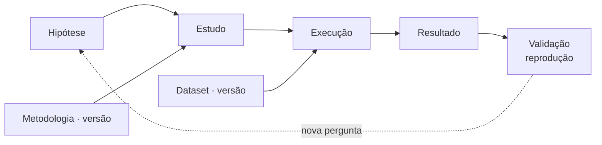
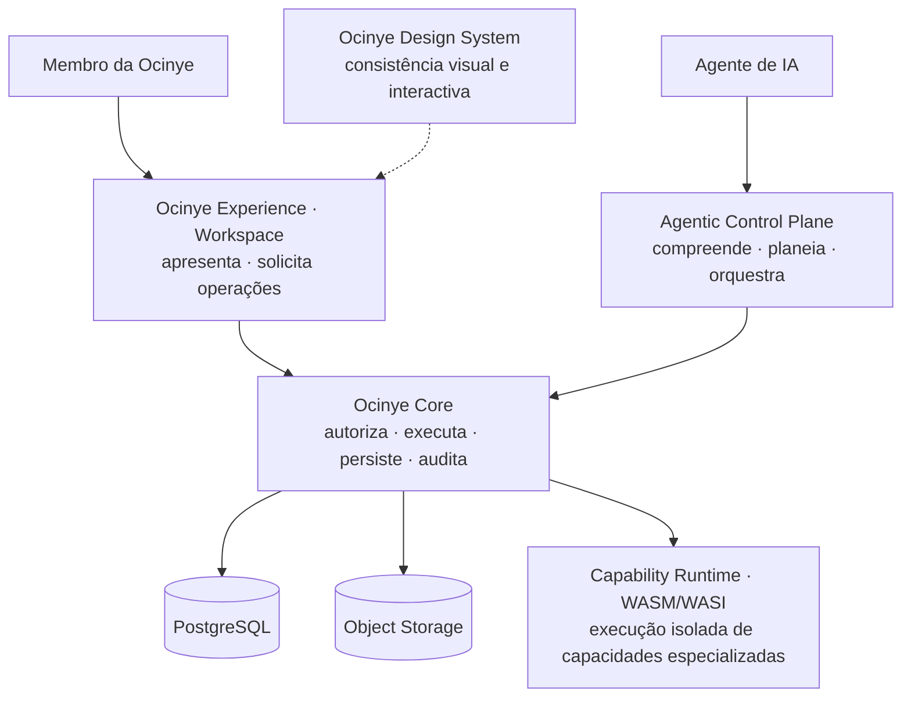

# Ocinye OS

**Sistema operacional institucional AI-native.**

> **O Ocinye OS é a infraestrutura digital institucional através da qual a
> Ocinye organiza, governa, preserva e transforma conhecimento, dados,
> investigação e engenharia em capacidade tecnológica duradoura.**

**A Ocinye** é uma instituição angolana de investigação aplicada, engenharia e
infraestruturas tecnológicas. **O Ocinye OS** é a sua infraestrutura digital
institucional. Não se confundem: a instituição tem existência própria, e o
sistema existe para a suportar.

Não é um sistema operativo de hardware, nem uma distribuição de software, nem uma
colecção de aplicações internas.

---

## Porque existe

Investigadores saem. Projectos terminam. Equipamentos mudam. Financiamentos
acabam. Software é substituído, e modelos de IA são trocados por outros melhores.

> **People may leave. Projects may end. Software may be replaced. AI models may
> change. Institutional knowledge must remain.**

A resposta por omissão a cada necessidade é construir mais uma aplicação: um
sítio com área privada, um gestor documental, um painel administrativo, uma
integração de IA. Ao fim de alguns anos a instituição tem sete sistemas que não
se conhecem, sete modelos de identidade e nenhuma memória.

O Ocinye OS existe para recusar esse caminho. A finalidade não é preservar
software:

> **The purpose of Ocinye OS is not to preserve software. It is to preserve and
> amplify the institution's capacity to know, investigate, engineer and build.**

### Memória institucional

A memória institucional não é um módulo, e não tem tabela nem ecrã próprio. É uma
propriedade que emerge da composição governada do que o sistema já guarda:
conhecimento, dados e as suas versões, projectos, metodologias, resultados,
documentos e auditoria, com a **proveniência** que preserva as relações entre os
recursos e a **linhagem científica** que permite navegá-las ao longo do tempo.

---

## Da investigação à capacidade tecnológica

Uma pergunta pode tornar-se hipótese; a hipótese é testada num estudo; o estudo
segue uma versão de metodologia; uma execução concreta utiliza os dados
aplicáveis e produz resultados, que podem depois ser validados ou reproduzidos.
Cada passo fica ligado ao anterior, e a ligação é consultável anos depois.



Um **estudo** representa uma experiência física, uma simulação ou uma análise —
são géneros do mesmo objecto, e não três entidades diferentes.

> O ciclo representa relações possíveis e rastreáveis de produção de
> conhecimento. **Não é um workflow linear obrigatório.**

A ciência volta atrás, repete execuções e produz resultados negativos. Uma
hipótese refutada e uma validação que contradisse são memória institucional
válida, e o domínio representa-as explicitamente.

O ciclo científico não é o ciclo do projecto: o primeiro é produção de
conhecimento, o segundo é administração e operação. Coexistem e não se
substituem.

Detalhe: [ciclo de vida científico](docs/architecture/scientific-lifecycle.md).

---

## Proveniência e linhagem científica

> **Proveniência responde: de onde veio este resultado?**
>
> **Auditoria responde: o que aconteceu no sistema?**

São perguntas diferentes, e um registo completo de uma não responde à outra.

A proveniência é tipada: uma relação só existe se a tripla *tipo de origem +
verbo + tipo de destino* for permitida, e a matriz falha fechada. Aponta sempre
para a **versão** quando a versão importa — `MethodologyVersion`,
`DatasetVersion` — porque um resultado produzido com a versão 2 tem de continuar
a dizer «versão 2» depois de a 5 existir.

Cada relação guarda de onde veio: `operation`, quando o Core a **observou** ao
produzir o efeito; `declared`, quando alguém a **afirmou** através de uma
operação autorizada.

> **Model inference is not institutional provenance.**

Um agente pode sugerir uma relação. A sugestão só se torna facto institucional
atravessando a mesma operação autorizada que uma pessoa atravessaria — e fica
marcada como declarada.

### Linhagem

> **A linhagem científica é a projecção navegável das relações de proveniência.**
> Deriva da proveniência registada; não é uma segunda fonte de verdade.

| | |
|---|---|
| **Montante** | De que depende isto? |
| **Jusante** | O que passou a depender disto? |

A montante de um resultado, como o Workspace o mostra — cada linha é uma aresta,
com o que a operação afirma no meio:

```text
A resistência caiu 18%          produzido por   Ensaio de carga · execução 3
Ensaio de carga · execução 3    segue           Medição a quatro pontas · v2
SCADA Parque A · v4             entra em        Ensaio de carga · execução 3
Ensaio de carga                 testa           A dopagem reduz a resistência
```

Lê-se por títulos e por versões. Nenhum identificador aparece como texto: um
`UUID` é a resposta a outra pergunta, a de quem está a depurar uma consulta.

A travessia respeita autorização **em cada salto**. Se um nó intermédio não é
legível, a travessia termina aí e não devolve nada sobre ele — nem existência,
nem contagem. Conhecer uma relação não concede acesso ao que ela liga.

Detalhe: [proveniência e linhagem](docs/architecture/scientific-lifecycle.md).

---

## Princípios arquitecturais

Seis, e os restantes vivem na arquitectura e nas ADRs. Repetir um princípio em
cinco sítios não o torna mais verdadeiro; torna-o mais fácil de contradizer.

**Core is authority. Experience is presentation. Design System is consistency.**
A autoridade institucional reside exclusivamente no Ocinye Core. A Experience
apresenta o estado do sistema e permite solicitar operações; não define
permissões nem altera directamente o estado institucional. O Design System governa
consistência visual e interactiva, e o Core não o conhece.

**Ocinye OS is operated with AI, governed by the Core.** Os agentes compreendem
intenções, planeiam e orquestram. O Core autoriza, executa, persiste e verifica
qualquer efeito institucional.

**AI-native, not AI-dependent.** A inteligência artificial é uma capacidade
transversal, e não o substrato institucional. As funções determinísticas
permanecem disponíveis sem modelos, GPUs ou fornecedores; as que exigem
inferência declaram-se indisponíveis com a razão. O sistema não está preso a
nenhum fornecedor nem a nenhum modelo, e o conhecimento não pertence ao modelo.

**Deny by default.** Na ausência de uma autorização explícita e válida, o acesso é
negado. Recursos, operações e campos só ficam acessíveis quando a política
aplicável os autoriza.

**Model output is never system state.** A saída de um modelo é conteúdo ou
proposta. Só uma operação autorizada pelo Core altera o estado institucional — e
as afirmações institucionais permanecem distinguíveis das sugestões de um modelo.

**Dual Entry, Single Authority.** Quando uma operação é delegável a um agente, a
interface humana e o percurso agentic convergem na mesma Core Operation. Nenhum
dos dois mantém uma implementação alternativa nem acesso directo ao estado.

Nem toda a operação é delegável, e a excepção é deliberada: validar um resultado
científico é uma afirmação institucional cujo peso é de quem a faz, e nenhum
agente a alcança — nem com aprovação
([ADR-0307](docs/adrs/0307-dual-entry-single-authority.md)).

Os restantes — capabilities tipadas, fronteira do adaptador de inferência,
Rust-first, e a separação entre realidade corrente e roadmap — estão em
[docs/architecture/](docs/architecture/README.md) e nas
[ADRs](docs/adrs/README.md).

---

## Arquitectura

O sistema lê-se por duas perguntas. Esta é a primeira — **quem pode produzir
efeitos?** — e a resposta são quatro planos com responsabilidades que não se
sobrepõem.



As linhas cheias representam caminhos de execução, controlo ou dados em runtime.
A relação tracejada representa uma dependência de apresentação: o Design System
governa a Experience, mas não participa no caminho de autoridade nem é conhecido
pelo Core.

**O Core pode delegar computação especializada ao Capability Runtime**, mantendo
a autorização, a validação e o estado institucional fora do ambiente WASM. O
primeiro uso operacional é a validação e normalização de referências
bibliográficas BibTeX ([ADR-0501](docs/adrs/0501-capability-runtime-wasm.md)).

**O arranque depende da prontidão do Core.** Antes de apresentar o Login ou o
Workspace, a Experience consulta a prontidão institucional declarada pelo Core. A
Experience apresenta esse estado; não o calcula nem o substitui
([ADR-0603](docs/adrs/0603-boot-and-institutional-readiness.md)).

A segunda pergunta é **para que serve o sistema?**, e a resposta organiza-o
noutro eixo: a infraestrutura institucional horizontal — identidade, autorização,
colaboração, conhecimento, dados, correio, calendário, mensagens, inteligência,
computação — e, sobre ela, a camada de produção científica que gera proveniência,
linhagem e memória. O diagrama está em
[docs/architecture/](docs/architecture/README.md#infraestrutura-horizontal-e-produção-científica).

Detalhe: [docs/architecture/](docs/architecture/README.md) ·
[docs/agentic/](docs/agentic/README.md) ·
[docs/authorization/](docs/authorization/README.md).

---

## Estado actual da implementação

**Capacidade implementada** — o que existe no repositório, e que qualquer clone
tem depois de aplicar as migrations:

| | |
|---|---|
| Identidade, autorização, unidades, ambientes de investigação | implementado |
| Conhecimento: bibliografia, fontes, notas, documentos | implementado |
| Dados: datasets e versões | implementado |
| **Ciclo científico**: hipóteses, metodologias e versões, estudos, execuções, resultados, validações | implementado |
| **Proveniência** tipada, autorizada e com referências exactas a versões; **linhagem** montante e jusante | implementado |
| Colaboração: tarefas, calendário, mensagens | implementado |
| Correio institucional: transporte IMAP/SMTP, caixas por membro | implementado |
| Plano agentic: capabilities tipadas, planos, aprovações | implementado |
| Capability Runtime WASM/WASI, com um consumidor: validação e normalização BibTeX | implementado |
| Armazenamento de objectos S3-compatible | implementado |

**Configuração de instalação** — o que depende de cada ambiente, e não do
repositório:

| | |
|---|---|
| Correio | exige configuração IMAP/SMTP e credenciais de cada membro; sem ela, o Core declara-o não configurado |
| Inteligência artificial | exige um fornecedor registado; sem ele, `Perguntar` e `Executar` declaram-se indisponíveis |
| Computação | exige nós registados; o registo suporta zero |
| Armazenamento | exige um endpoint S3-compatible |

O Core apura o estado real e serve-o em `GET /api/v1/system/capabilities`; a
Experience apresenta-o, e não o calcula. Um clone com a configuração mínima de
referência não possui automaticamente transporte de correio, fornecedor de IA ou
nós computacionais — e isso é o estado correcto, não uma avaria.

Matriz completa: [docs/feature-status/](docs/feature-status/README.md).

---

## Limitações actuais

- **Não existe ambiente de produção.** O sistema corre em desenvolvimento local.
  Repositório público e `main` protegida não são produção.
- **A configuração de referência não provisiona fornecedores de IA nem nós
  computacionais.** As funções determinísticas — incluindo toda a cadeia
  científica e a pesquisa — permanecem disponíveis; as capacidades que dependem
  desses recursos só ficam disponíveis quando a instalação os regista.
- **A linhagem científica tem tecto de cinco saltos.** A partir daí continua-se
  abrindo um dos recursos mostrados.
- **A proveniência de computação e de software é parcial.** Uma execução regista
  o nome, a versão e o commit do software como campos, e não como recursos com
  identidade; a aresta para um nó de computação ainda não é escrita.
- **A reprodução entre execuções não é uma aresta.** Regista-se como validação
  com a execução que a sustenta.
- **A camada científica não é um caderno de laboratório electrónico**, e não
  substitui software científico. Protótipos, publicações e propriedade
  intelectual não existem como entidades.
- **O Workspace não hidrata no cliente.** A renderização é no servidor, com
  melhoria progressiva: o JavaScript acrescenta conforto, nunca comportamento
  institucional.
- **O Capability Runtime tem um consumidor operacional, e é isso que tem.** Não
  existe um sistema genérico de extensões instaláveis; cada componente é
  escolhido pelo Core em código
  ([ADR-0501](docs/adrs/0501-capability-runtime-wasm.md)).
- **O envio de correio ainda não é durável.** É síncrono contra o fornecedor. A
  tabela `mail_outbox` permanece no esquema por história de migrações e não
  participa no fluxo actual.

---

## Mapa do repositório

```
crates/
  ocinye-contracts       Tipos canónicos partilhados. Sem I/O; compila para wasm32.
  ocinye-domain          Invariantes puros, autorização, workflows e políticas do
                         plano agentic.
  ocinye-observability   Logging estruturado e correlação.
  ocinye-core            Persistência e serviços de aplicação, por domínio.
  ocinye-capabilities    Capability Runtime WASM/WASI — execução isolada de
                         capacidades especializadas, invocada pelo Core.

services/
  core-server            Core Runtime — API HTTP (Axum).
  worker                 Worker Runtime — drena o outbox e entrega lembretes.
  node-agent             Node Runtime — base contratual para integração futura de
                         nós computacionais; ainda sem execução operacional.

apps/
  workspace              Experience Runtime — Axum + Leptos, renderização no
                         servidor.

wasm/capabilities/       Capabilities isoladas. Alvo wasm32-wasip1.
design/                  Dossier de design do Workspace.
migrations/              Migrations SQL versionadas.
infra/                   Docker Compose para desenvolvimento local.
docs/                    Arquitectura, ADRs, segurança, operação.
scripts/                 Desenvolvimento, build e verificação.
```

Cada parte significativa tem o seu próprio `README.md`.

---

## Quick start

Requisitos: Docker e Rust instalado através de `rustup` — o toolchain vem de
[`rust-toolchain.toml`](rust-toolchain.toml).

```bash
cp .env.example .env                                   # não contém segredos reais
docker compose -f infra/compose/docker-compose.yml up -d
cargo install sqlx-cli --no-default-features --features rustls,postgres
sqlx migrate run --source migrations

cargo run --bin ocinye-core-server                     # http://localhost:8080
cargo run --bin ocinye-worker                          # noutro terminal
cargo run --bin ocinye-workspace                       # http://localhost:8090
```

Crie o primeiro administrador uma única vez. A palavra-passe temporária é
apresentada apenas nessa execução:

```bash
cargo run --bin ocinye-core-server -- bootstrap-admin \
  --name "Nome Completo" --email pessoa@ocinye.com
```

No primeiro acesso, o administrador deve substituir a palavra-passe temporária.
Não existe palavra-passe de bootstrap permanente
([runbook](docs/runbooks/bootstrap-first-administrator.md)).

Passo a passo, incluindo diagnóstico quando algum serviço não arranca:
[docs/development/](docs/development/README.md).

---

## Verificação

```bash
./scripts/verify.sh
```

Executa formatação, Clippy, os gates arquitecturais, a suite de testes completa
— incluindo percursos de browser conduzidos num Chrome real — builds de release,
capabilities WASM, os contratos de documentação, e as auditorias de segredos e de
dependências.

Cinco gates protegem propriedades transversais que nenhum teste isolado consegue
demonstrar:

| Gate | Propriedade protegida |
|---|---|
| Verification Harness Integrity | impede um resultado `PASS` produzido sem observação válida |
| Architecture Dependency Boundary | impede dependências arquitecturais não autorizadas, incluindo a promoção silenciosa de dependências de teste para produção |
| Experience Structural Boundary | impede acesso directo da Experience à persistência ou à autorização |
| Design System Integrity | impede valores visuais governados escritos fora do Design System |
| Rendered-Value Equivalence | detecta alterações renderizadas não deliberadas durante migrações estruturais |

E quatro contratos confrontam o que está escrito com o que existe: o catálogo de
operações contra a matriz publicada, a biblioteca de ADRs contra a sua taxonomia,
a Secção 1 do `CLAUDE.md` contra os factos derivados da árvore, e o contrato de
enumeração contra as suites que sustentam afirmações de cobertura.

> **Verde não chega. Uma suite só é prova se os testes que se esperava dela foram
> descobertos e correram.**

A verificação é de leitura: se alterar um ficheiro versionado, falha.

Estados, contratos de enumeração e o inventário de suites:
[docs/testing/](docs/testing/README.md).

---

## Documentação

| Documento | Descrição |
|---|---|
| [Arquitectura](docs/architecture/README.md) | Definição canónica, planos, fronteiras e arranque |
| [Ciclo científico, proveniência e linhagem](docs/architecture/scientific-lifecycle.md) | Os objectos científicos, a proveniência tipada e a linhagem navegável |
| [ADRs](docs/adrs/README.md) | Decisões arquitecturais, contexto e consequências |
| [Estado das funcionalidades](docs/feature-status/README.md) | Estado factual e funcionalidades planeadas |
| [Agentic](docs/agentic/README.md) | Plano de controlo, capabilities e matriz de operações |
| [Autorização](docs/authorization/README.md) | RBAC, ABAC contextual e negação por omissão |
| [Identidade](docs/identity/README.md) | Contas, credenciais e sessões |
| [Segurança](docs/security/README.md) | Controlos, baselines e verificações de segurança |
| [Modelo de ameaças](docs/threat-model/README.md) | Fronteiras de confiança e adversários considerados |
| [Modelo de dados](docs/data-model/README.md) | Esquema, migrations e invariantes |
| [Contrato UI ↔ Core](docs/ui-core-contract/README.md) | Contrato entre apresentação e autoridade |
| [Conhecimento](docs/knowledge/README.md) · [Domínio](docs/domain/README.md) | Artefactos de investigação e o modelo institucional |
| [Testes](docs/testing/README.md) | Suites, gates e disciplina de evidência |
| [Desenvolvimento](docs/development/README.md) | Ambiente, ferramentas e regras de engenharia |
| [Operação](docs/operations/README.md) · [Runbooks](docs/runbooks/README.md) | Operação, diagnóstico e recuperação |
| [Deployment](docs/deployment/README.md) | Requisitos para uma futura produção |

---

## Disciplina de engenharia

As regras de desenvolvimento, verificação e evidência estão documentadas em
[docs/development/](docs/development/README.md#disciplina-de-evidência). Em
particular: uma afirmação sobre o estado do sistema tem de ser sustentada por
evidência executada; um teste que não correu não constitui evidência, e um
verificador que não produziu observações válidas não constitui evidência alguma.
