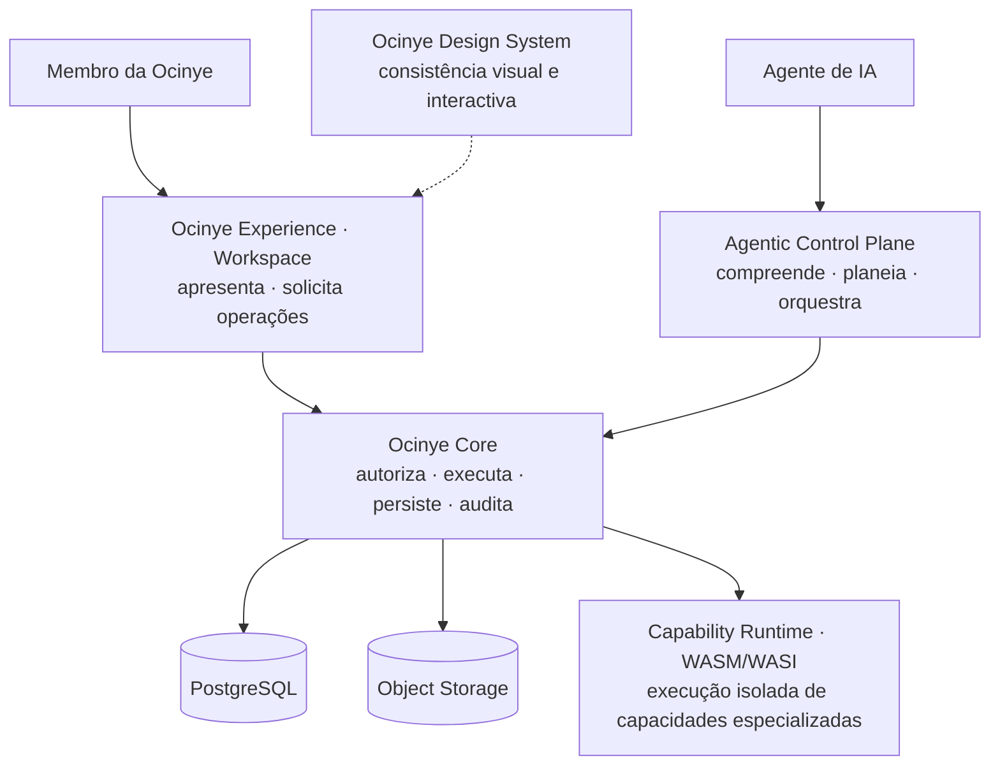

# Ocinye OS

**Sistema operacional institucional AI-native.**

O Ocinye OS é a plataforma digital através da qual a Ocinye organiza
investigação, engenharia, conhecimento, dados, colaboração, comunicação e
recursos computacionais. Não é um sistema operativo de hardware nem uma
distribuição de software: é a infraestrutura institucional que coordena estas
capacidades sob uma arquitectura comum, segura e auditável.

> **Ocinye OS is operated with AI, governed by the Core.**
>
> **AI-native, not AI-dependent.**

**A Ocinye** é uma instituição angolana de investigação aplicada, engenharia e
infraestruturas digitais. **O Ocinye OS** é o sistema institucional que suporta a
sua operação digital. A instituição e o sistema não se confundem: a Ocinye possui
existência institucional própria, e o Ocinye OS existe para suportar a sua
operação e preservar a sua continuidade digital ao longo do tempo.

---

## Princípios arquitecturais

**Core is authority. Experience is presentation. Design System is consistency.**
A autoridade institucional reside exclusivamente no Ocinye Core. A Experience
apresenta o estado do sistema e permite solicitar operações; não define
permissões nem altera directamente o estado institucional.

**Operated with AI, governed by the Core.** Os agentes de IA podem compreender
intenções, planear e orquestrar operações. O Core continua responsável por
autorizar, executar, persistir e verificar qualquer efeito institucional.

**AI-native, not AI-dependent.** A arquitectura integra inteligência artificial
como capacidade transversal, mas não depende dela para operar. As funções
determinísticas permanecem disponíveis sem modelos, GPUs ou fornecedores de IA;
as funcionalidades que exigem inferência permanecem indisponíveis enquanto esses
recursos não existirem.

**Deny by default.** Na ausência de uma autorização explícita e válida, o acesso
é negado. Recursos, operações e campos só ficam acessíveis quando a política
aplicável os autoriza.

**Model output is never system state.** A saída de um modelo é conteúdo ou
proposta, nunca uma alteração do sistema. Só uma operação autorizada e confirmada
pelo Core pode modificar o estado institucional.

**Agents act only through typed authorised capabilities.** Os agentes só podem
solicitar operações através de capabilities tipadas e registadas num conjunto
fechado, definido em código. Não recebem acesso directo ou irrestrito a shell,
SQL, sistema de ficheiros, rede, persistência ou segredos.

**A capability describes an executable operation; it does not grant authority.**
Uma capability descreve o que pode ser solicitado. A autorização é reavaliada
imediatamente antes da execução, segundo a identidade, os recursos e a política
válidos nesse momento — **um plano preserva intenção, não permissão**.

**Provider-specific formats terminate at the adapter boundary.** O contrato de
inferência é definido pelo Ocinye OS. Formatos, APIs e particularidades de
fornecedores permanecem confinados aos respectivos adaptadores.

**Rust-first, not Rust-only.** Os componentes institucionais são desenvolvidos
preferencialmente em Rust. O trabalho científico não está sujeito a essa
restrição e utiliza as ferramentas adequadas a cada domínio
([ADR-0004](docs/adrs/0004-rust-first.md)).

**Current reality is never confused with roadmap.** Os estados operacionais são
apurados pelo Core e servidos em `GET /api/v1/system/capabilities`. As
funcionalidades futuras são identificadas explicitamente segundo a taxonomia
canónica do repositório, e nunca apresentadas como capacidades disponíveis.

Detalhe: [docs/architecture/](docs/architecture/README.md).

---

## Arquitectura

Quatro planos, com responsabilidades que não se sobrepõem.



As linhas cheias são caminhos que o sistema percorre hoje; as tracejadas são
fronteiras implementadas que ainda não têm consumidor operacional.

**O Core pode delegar computação especializada ao Capability Runtime**, mantendo
a autorização, a validação e o estado institucional fora do ambiente WASM. O
primeiro uso operacional é a validação e normalização de referências
bibliográficas BibTeX ([ADR-0501](docs/adrs/0501-capability-runtime-wasm.md)).

**Dual Entry, Single Authority.** Quando uma operação pode ser delegada a um
agente, a interface humana e o percurso agentic convergem na mesma Core
Operation. Nenhum dos dois mantém uma implementação alternativa da operação nem
acesso directo ao estado institucional.

**O arranque depende da prontidão do Core.** Antes de apresentar o Login ou o
Workspace, a Experience consulta a prontidão institucional declarada pelo Core. A
Experience apresenta esse estado; não o calcula nem o substitui
([ADR-0603](docs/adrs/0603-boot-and-institutional-readiness.md)).

Detalhe: [docs/architecture/](docs/architecture/README.md) ·
[docs/agentic/](docs/agentic/README.md) ·
[docs/authorization/](docs/authorization/README.md).

---

## Estado desta instalação

O Core é a fonte canónica do estado operacional. A tabela resume o que esta
instalação apresenta hoje; a matriz de funcionalidades mantém a classificação
completa e o vocabulário que a governa.

| | |
|---|---|
| Identidade, autorização, unidades, investigação, conhecimento, dados, colaboração, calendário | disponíveis |
| Ferramentas bibliográficas (validação e normalização BibTeX) | disponíveis |
| Armazenamento de objectos | disponível |
| Correio | não configurado nesta instalação |
| Inteligência artificial, computação | nenhum recurso registado |

Matriz completa: [docs/feature-status/](docs/feature-status/README.md).

---

## Mapa do repositório

```
crates/
  ocinye-contracts       Tipos canónicos partilhados. Sem I/O; compila para wasm32.
  ocinye-domain          Invariantes puros, autorização, workflows e políticas do
                         plano agentic.
  ocinye-observability   Logging estruturado e correlação.
  ocinye-core            Persistência e serviços de aplicação, por domínio.
  ocinye-capabilities    Capability Runtime WASM/WASI — execução isolada de
                         capacidades especializadas, invocada pelo Core.

services/
  core-server            Core Runtime — API HTTP (Axum).
  worker                 Worker Runtime — drena o outbox e entrega lembretes.
  node-agent             Node Runtime — base contratual para integração futura de
                         nós computacionais; ainda sem execução operacional.

apps/
  workspace              Experience Runtime — Axum + Leptos, renderização no
                         servidor.

wasm/capabilities/       Capabilities isoladas. Alvo wasm32-wasip1.
design/                  Dossier de design do Workspace.
migrations/              Migrations SQL versionadas.
infra/                   Docker Compose para desenvolvimento local.
docs/                    Arquitectura, ADRs, segurança, operação.
scripts/                 Desenvolvimento, build e verificação.
```

Cada parte significativa tem o seu próprio `README.md`.

---

## Quick start

Requisitos: Docker e Rust instalado através de `rustup` — o toolchain vem de
[`rust-toolchain.toml`](rust-toolchain.toml).

```bash
cp .env.example .env                                   # não contém segredos reais
docker compose -f infra/compose/docker-compose.yml up -d
cargo install sqlx-cli --no-default-features --features rustls,postgres
sqlx migrate run --source migrations

cargo run --bin ocinye-core-server                     # http://localhost:8080
cargo run --bin ocinye-worker                          # noutro terminal
cargo run --bin ocinye-workspace                       # http://localhost:8090
```

Crie o primeiro administrador uma única vez. A palavra-passe temporária é
apresentada apenas nessa execução:

```bash
cargo run --bin ocinye-core-server -- bootstrap-admin \
  --name "Nome Completo" --username nome.utilizador --email pessoa@ocinye.com
```

No primeiro acesso, o administrador deve substituir a palavra-passe temporária.
Não existe palavra-passe de bootstrap permanente
([runbook](docs/runbooks/bootstrap-first-administrator.md)).

Passo a passo, incluindo diagnóstico quando algum serviço não arranca:
[docs/development/](docs/development/README.md).

---

## Verificação

```bash
./scripts/verify.sh
```

Executa formatação, Clippy, os gates arquitecturais, a suite de testes completa
— incluindo percursos de browser conduzidos num Chrome real — builds de release,
capabilities WASM, e as auditorias de segredos e de dependências.

Cinco gates de verificação protegem propriedades transversais que nenhum teste
isolado consegue demonstrar:

| Gate | Propriedade protegida |
|---|---|
| Verification Harness Integrity | impede um resultado `PASS` produzido sem observação válida |
| Architecture Dependency Boundary | impede dependências arquitecturais não autorizadas, incluindo a promoção silenciosa de dependências de teste para produção |
| Experience Structural Boundary | impede acesso directo da Experience à persistência ou à autorização |
| Design System Integrity | impede valores visuais governados escritos fora do Design System |
| Rendered-Value Equivalence | detecta alterações renderizadas não deliberadas durante migrações estruturais |

A verificação é de leitura: se alterar um ficheiro versionado, falha.

Estados, contratos de enumeração e o inventário de suites:
[docs/testing/](docs/testing/README.md).

---

## Limitações actuais

- **Não existe ambiente de produção.** O sistema corre em desenvolvimento local.
- **Não existem fornecedores de IA nem nós computacionais registados.** As
  funcionalidades determinísticas permanecem disponíveis; as que exigem
  inferência ou execução computacional permanecem indisponíveis.
- **O correio não está configurado nesta instalação.**
- **O Workspace não hidrata no cliente.** A renderização é no servidor, com
  melhoria progressiva: o JavaScript acrescenta conforto, nunca comportamento
  institucional.
- **O Capability Runtime tem um primeiro consumidor operacional, e é isso que
  tem.** A validação de bibliografia BibTeX atravessa o isolamento WASM/WASI; não
  existe um sistema genérico de extensões instaláveis, e cada componente é
  escolhido pelo Core em código
  ([ADR-0501](docs/adrs/0501-capability-runtime-wasm.md)).
- **O envio de correio ainda não é durável.** O envio actual é síncrono contra o
  fornecedor. A tabela `mail_outbox` permanece no esquema por história de
  migrações, mas não participa no fluxo de envio actual.

---

## Documentação

| Documento | Descrição |
|---|---|
| [Arquitectura](docs/architecture/README.md) | Planos, fronteiras, arranque e relações de confiança |
| [ADRs](docs/adrs/README.md) | Decisões arquitecturais, contexto e consequências |
| [Estado das funcionalidades](docs/feature-status/README.md) | Estado factual e funcionalidades planeadas |
| [Agentic](docs/agentic/README.md) | Plano de controlo, capabilities e matriz de operações |
| [Autorização](docs/authorization/README.md) | RBAC, ABAC contextual e negação por omissão |
| [Identidade](docs/identity/README.md) | Contas, credenciais e sessões |
| [Segurança](docs/security/README.md) | Controlos, baselines e verificações de segurança |
| [Modelo de ameaças](docs/threat-model/README.md) | Fronteiras de confiança e adversários considerados |
| [Modelo de dados](docs/data-model/README.md) | Esquema, migrations e invariantes |
| [Contrato UI ↔ Core](docs/ui-core-contract/README.md) | Contrato entre apresentação e autoridade |
| [Testes](docs/testing/README.md) | Suites, gates e disciplina de evidência |
| [Desenvolvimento](docs/development/README.md) | Ambiente, ferramentas e regras de engenharia |
| [Operação](docs/operations/README.md) · [Runbooks](docs/runbooks/README.md) | Operação, diagnóstico e recuperação |
| [Deployment](docs/deployment/README.md) | Requisitos para uma futura produção |

---

## Disciplina de engenharia

As regras de desenvolvimento, verificação e evidência estão documentadas em
[docs/development/](docs/development/README.md#disciplina-de-evidência). Em
particular: uma afirmação sobre o estado do sistema tem de ser sustentada por
evidência executada; um teste que não correu não constitui evidência, e um
verificador que não produziu observações válidas não constitui evidência alguma.
