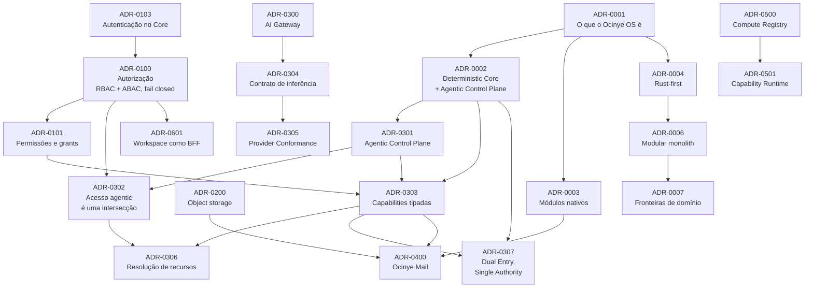

# Architecture Decision Records

As decisões arquitecturais do Ocinye OS. Cada uma regista o contexto em que
foi tomada, as alternativas consideradas, a decisão, e o que dela decorre.

---

## Start here

Não é preciso ler tudo. Três caminhos, conforme o que se procura:

**Compreender o sistema.** Comece por
[ADR-0001](0001-ocinye-os-definition.md), que define o que o Ocinye OS é, e
siga as quatro decisões `FOUNDATIONAL` que dela derivam. Meia hora.

**Trabalhar num domínio.** Leia as fundacionais, depois a família do seu
domínio — a primeira ADR de cada família é a sua decisão estruturante.

**Acrescentar um fornecedor de IA.** [ADR-0300](0300-ai-gateway.md) →
[ADR-0304](0304-canonical-inference-contract.md) →
[ADR-0305](0305-provider-conformance.md).

---

## Decisões fundacionais

Definem a identidade e as invariantes estruturais do Ocinye OS. Tudo o resto
assenta nelas.

| ADR | Decisão |
|---|---|
| [0001](0001-ocinye-os-definition.md) | O Ocinye OS como sistema operacional institucional AI-native |
| [0002](0002-deterministic-core-and-agentic-control-plane.md) | Deterministic Core + Agentic Control Plane |
| [0003](0003-native-modules.md) | Módulos nativos, não aplicações desligadas |
| [0004](0004-rust-first.md) | Rust-first como princípio tecnológico da Ocinye |
| [0100](0100-authorization-model.md) | RBAC + ABAC contextual, fail closed |

Uma seta significa **B pressupõe A**. Não significa que A seja mais
importante do que B em todos os sentidos.

O grafo mostra as decisões fundacionais e as de maior alcance. As restantes
declaram as suas dependências no próprio ficheiro.

---

## Por domínio

### 0001–0099 · Foundations

O que o Ocinye OS é, onde reside a autoridade, e sobre que runtime assenta.

- [ADR-0001](0001-ocinye-os-definition.md) — O Ocinye OS como sistema operacional institucional AI-native
- [ADR-0002](0002-deterministic-core-and-agentic-control-plane.md) — Deterministic Core + Agentic Control Plane
- [ADR-0003](0003-native-modules.md) — Módulos nativos, não aplicações desligadas
- [ADR-0004](0004-rust-first.md) — Rust-first como princípio tecnológico da Ocinye
- [ADR-0005](0005-monorepo-cargo-workspace.md) — Monorepo com Cargo workspace
- [ADR-0006](0006-modular-monolith.md) — Ocinye Core como modular monolith
- [ADR-0007](0007-domain-boundaries-in-modules.md) — Fronteiras de domínio como módulos, e a API separada do núcleo
- [ADR-0008](0008-axum-tokio-core-runtime.md) — Axum + Tokio para o Core Runtime
- [ADR-0009](0009-postgresql-sqlx.md) — PostgreSQL com SQLx e SQL explícito
- [ADR-0010](0010-events-outbox.md) — Eventos de domínio com transactional outbox
- [ADR-0011](0011-redis.md) — Redis para filas e coordenação
- [ADR-0012](0012-realtime-plane.md) — O plano realtime: uma ligação que dura, sobre uma autoridade que não

### 0100–0199 · Identidade, Segurança, Autorização e Governação

Quem entra, o que pode, e como fica registado.

- [ADR-0100](0100-authorization-model.md) — RBAC + ABAC contextual, fail closed
- [ADR-0101](0101-permissions-scopes-and-grants.md) — Permissões nomeadas, âmbitos e grants explícitos
- [ADR-0102](0102-identity-provider.md) — Identity Provider dedicado (Keycloak) — **Superseded**
- [ADR-0103](0103-core-owned-authentication.md) — Autenticação no Ocinye Core (username + password)
- [ADR-0104](0104-password-policy-and-hashing.md) — Política de palavras-passe e armazenamento de verificadores
- [ADR-0106](0106-email-as-the-single-credential.md) — O endereço institucional é a credencial única
- [ADR-0105](0105-dependency-advisory-coverage.md) — Nenhuma base de advisories é tratada como exaustiva

### 0200–0299 · Conhecimento, Dados, Armazenamento e Memória Institucional

Onde o material da instituição vive, e o que o acompanha.

- [ADR-0200](0200-object-storage.md) — Object Storage S3-compatible
- [ADR-0201](0201-data-residency.md) — Residência de dados explícita
- [ADR-0202](0202-search-fts-pgvector.md) — Pesquisa: PostgreSQL FTS agora, pgvector preparado
- [ADR-0203](0203-institutional-model-artifacts.md) — Artefactos de modelo como memória institucional
- [ADR-0204](0204-institutional-files-and-folders.md) — O ficheiro institucional é a autoridade sobre os bytes
- [ADR-0205](0205-content-extraction-and-lexical-body-search.md) — Extracção de conteúdo e pesquisa lexical do corpo
- [ADR-0206](0206-embeddings-and-hybrid-retrieval.md) — Embeddings versionados e recuperação híbrida

### 0300–0399 · IA, Controlo Agentic e Inferência

Como a inteligência opera o sistema sem o governar.

- [ADR-0300](0300-ai-gateway.md) — AI Gateway orientado a capacidades
- [ADR-0301](0301-agentic-control-plane.md) — O Agentic Control Plane: Main Agent, Runtime, Registry
- [ADR-0302](0302-agent-access-intersection.md) — Effective Agent Access é uma intersecção
- [ADR-0303](0303-capability-registry-and-executor.md) — Capabilities tipadas: registry, executor, risco e aprovação
- [ADR-0304](0304-canonical-inference-contract.md) — O contrato canónico de inferência
- [ADR-0305](0305-provider-conformance.md) — Conformidade de fornecedor como fronteira obrigatória
- [ADR-0306](0306-resource-resolution-as-authorization-boundary.md) — Resolução de recursos como fronteira de autorização
- [ADR-0307](0307-dual-entry-single-authority.md) — Dual Entry, Single Authority: operabilidade agentic universal por capabilities tipadas

### 0400–0499 · Módulos Institucionais Nativos

Decisões próprias de cada módulo do Ocinye OS.

- [ADR-0400](0400-mail-as-institutional-surface.md) — Ocinye Mail como superfície institucional, não como cliente de email
- [ADR-0401](0401-mail-provider-abstraction.md) — Abstracção de fornecedor de correio
- [ADR-0402](0402-mail-html-sanitisation.md) — Higienização do HTML recebido por correio
- [ADR-0403](0403-mail-send-policy.md) — Enviar é exportar: política de classificação no envio
- [ADR-0404](0404-mail-privacy-boundary.md) — Uma caixa de correio pessoal não é alcançável por privilégio
- [ADR-0405](0405-mail-prompt-injection.md) — Conteúdo de correio é dado, nunca instrução
- [ADR-0406](0406-ai-generated-is-not-sent.md) — Texto gerado não é mensagem enviada
- [ADR-0407](0407-mail-index-not-archive.md) — `mail_messages` é um índice, não um arquivo
- [ADR-0408](0408-imap-transport.md) — O transporte IMAP: cifra obrigatória, pastas descobertas, sessão por operação
- [ADR-0411](0411-execution-time-principal-freshness.md) — Autoridade estabelece-se na execução, não no planeamento
- [ADR-0409](0409-mailbox-credentials-per-member.md) — Duas credenciais de correio: a da instituição e a de cada membro
- [ADR-0410](0410-temporal-center-and-native-calendar.md) — Ocinye Temporal Center e Calendário Nativo
- [ADR-0412](0412-scientific-lifecycle-and-provenance.md) — Ciclo de vida científico e proveniência de primeira classe

### 0500–0599 · Computação, Nós e Capability Runtime

Recursos computacionais e execução isolada.

- [ADR-0500](0500-compute-registry-node-agent.md) — Compute Registry e Node Agent
- [ADR-0501](0501-capability-runtime-wasm.md) — Capability Runtime em WebAssembly/WASI

### 0600–0699 · Workspace e Experience Plane

A interface humana.

- [ADR-0600](0600-leptos-workspace-runtime.md) — Leptos para o Workspace Runtime
- [ADR-0601](0601-workspace-bff-session.md) — O Workspace como Backend-for-Frontend
- [ADR-0602](0602-workspace-ssr-progressive-enhancement.md) — Workspace em SSR com progressive enhancement, hidratação adiada
- [ADR-0603](0603-boot-and-institutional-readiness.md) — Arranque do Ocinye OS e prontidão institucional
- [ADR-0604](0604-workspace-access-presentation.md) — Apresentação de acesso e autorização contextual no Workspace
- [ADR-0605](0605-first-production-deployment.md) — Primeira instalação de produção e fronteiras públicas de serviço
- [ADR-0606](0606-linked-privileged-identity.md) — Identidade privilegiada ligada

### 0700–0799 · Deployment, rede, operação e resiliência

Como o sistema sobrevive ao sítio onde corre.

- [ADR-0700](0700-institutional-continuity-and-portability.md) — Continuidade institucional e portabilidade entre servidores

Famílias sem ADRs não aparecem. `0800–0899` (integrações externas) e
`0900–0999` (reservado) estão vazias, e nenhuma ADR será criada apenas para as
preencher.

---

## Catálogo completo

| ADR | Decisão | Domínio | Impacto | Estado |
|---|---|---|---|---|
| [0001](0001-ocinye-os-definition.md) | O Ocinye OS como sistema operacional institucional AI-native | Foundation | `FOUNDATIONAL` | Accepted |
| [0002](0002-deterministic-core-and-agentic-control-plane.md) | Deterministic Core + Agentic Control Plane | Foundation | `FOUNDATIONAL` | Accepted |
| [0003](0003-native-modules.md) | Módulos nativos, não aplicações desligadas | Foundation | `FOUNDATIONAL` | Accepted |
| [0004](0004-rust-first.md) | Rust-first como princípio tecnológico da Ocinye | Foundation | `FOUNDATIONAL` | Accepted |
| [0005](0005-monorepo-cargo-workspace.md) | Monorepo com Cargo workspace | Foundation | `MEDIUM` | Accepted |
| [0006](0006-modular-monolith.md) | Ocinye Core como modular monolith | Foundation | `HIGH` | Accepted |
| [0007](0007-domain-boundaries-in-modules.md) | Fronteiras de domínio como módulos, e a API separada do núcleo | Foundation | `HIGH` | Accepted |
| [0008](0008-axum-tokio-core-runtime.md) | Axum + Tokio para o Core Runtime | Foundation | `MEDIUM` | Accepted |
| [0009](0009-postgresql-sqlx.md) | PostgreSQL com SQLx e SQL explícito | Foundation | `HIGH` | Accepted |
| [0010](0010-events-outbox.md) | Eventos de domínio com transactional outbox | Foundation | `HIGH` | Accepted |
| [0011](0011-redis.md) | Redis para filas e coordenação | Foundation | `MEDIUM` | Accepted |
| [0012](0012-realtime-plane.md) | O plano realtime: uma ligação que dura, sobre uma autoridade que não | Foundation | `HIGH` | Accepted |
| [0100](0100-authorization-model.md) | RBAC + ABAC contextual, fail closed | Security | `FOUNDATIONAL` | Accepted |
| [0101](0101-permissions-scopes-and-grants.md) | Permissões nomeadas, âmbitos e grants explícitos | Security | `HIGH` | Accepted |
| [0102](0102-identity-provider.md) | Identity Provider dedicado (Keycloak) | Identity | `HIGH` | Superseded |
| [0103](0103-core-owned-authentication.md) | Autenticação no Ocinye Core (username + password) | Identity | `HIGH` | Accepted |
| [0104](0104-password-policy-and-hashing.md) | Política de palavras-passe e armazenamento de verificadores | Identity | `MEDIUM` | Accepted |
| [0200](0200-object-storage.md) | Object Storage S3-compatible | Data | `HIGH` | Accepted |
| [0201](0201-data-residency.md) | Residência de dados explícita | Data | `MEDIUM` | Accepted |
| [0202](0202-search-fts-pgvector.md) | Pesquisa: PostgreSQL FTS agora, pgvector preparado | Knowledge | `MEDIUM` | Accepted |
| [0203](0203-institutional-model-artifacts.md) | Artefactos de modelo como memória institucional | Data | `FOUNDATIONAL` | Accepted |
| [0204](0204-institutional-files-and-folders.md) | O ficheiro institucional é a autoridade sobre os bytes | Data | `FOUNDATIONAL` | Accepted |
| [0205](0205-content-extraction-and-lexical-body-search.md) | Extracção de conteúdo e pesquisa lexical do corpo | Knowledge | `FOUNDATIONAL` | Accepted |
| [0206](0206-embeddings-and-hybrid-retrieval.md) | Embeddings versionados e recuperação híbrida | Knowledge | `FOUNDATIONAL` | Accepted |
| [0300](0300-ai-gateway.md) | AI Gateway orientado a capacidades | AI | `HIGH` | Accepted |
| [0301](0301-agentic-control-plane.md) | O Agentic Control Plane: Main Agent, Runtime, Registry | Agentic | `HIGH` | Accepted |
| [0302](0302-agent-access-intersection.md) | Effective Agent Access é uma intersecção | Agentic | `HIGH` | Accepted |
| [0303](0303-capability-registry-and-executor.md) | Capabilities tipadas: registry, executor, risco e aprovação | Agentic | `HIGH` | Accepted |
| [0304](0304-canonical-inference-contract.md) | O contrato canónico de inferência | AI | `HIGH` | Accepted |
| [0305](0305-provider-conformance.md) | Conformidade de fornecedor como fronteira obrigatória | AI | `HIGH` | Accepted |
| [0306](0306-resource-resolution-as-authorization-boundary.md) | Resolução de recursos como fronteira de autorização | Agentic | `HIGH` | Accepted |
| [0307](0307-dual-entry-single-authority.md) | Dual Entry, Single Authority: operabilidade agentic universal por capabilities tipadas | Agentic | `HIGH` | Accepted |
| [0400](0400-mail-as-institutional-surface.md) | Ocinye Mail como superfície institucional, não como cliente de email | Mail | `HIGH` | Accepted |
| [0401](0401-mail-provider-abstraction.md) | Abstracção de fornecedor de correio | Mail | `MEDIUM` | Accepted |
| [0402](0402-mail-html-sanitisation.md) | Higienização do HTML recebido por correio | Mail | `MEDIUM` | Accepted |
| [0403](0403-mail-send-policy.md) | Enviar é exportar: política de classificação no envio | Mail | `HIGH` | Accepted |
| [0404](0404-mail-privacy-boundary.md) | Uma caixa de correio pessoal não é alcançável por privilégio | Mail | `HIGH` | Accepted |
| [0405](0405-mail-prompt-injection.md) | Conteúdo de correio é dado, nunca instrução | Mail | `MEDIUM` | Accepted |
| [0406](0406-ai-generated-is-not-sent.md) | Texto gerado não é mensagem enviada | Mail | `MEDIUM` | Accepted |
| [0407](0407-mail-index-not-archive.md) | `mail_messages` é um índice, não um arquivo | Mail | `MEDIUM` | Accepted |
| [0408](0408-imap-transport.md) | O transporte IMAP: cifra obrigatória, pastas descobertas, sessão por operação | Mail | `LOCAL` | Accepted |
| [0409](0409-mailbox-credentials-per-member.md) | Duas credenciais de correio: a da instituição e a de cada membro | Mail | `HIGH` | Accepted |
| [0410](0410-temporal-center-and-native-calendar.md) | Ocinye Temporal Center e Calendário Nativo | Calendar | `HIGH` | Accepted |
| [0411](0411-execution-time-principal-freshness.md) | Autoridade estabelece-se na execução, não no planeamento | Security | `HIGH` | Accepted |
| [0412](0412-scientific-lifecycle-and-provenance.md) | Ciclo de vida científico e proveniência de primeira classe | Science | `HIGH` | Accepted |
| [0500](0500-compute-registry-node-agent.md) | Compute Registry e Node Agent | Compute | `HIGH` | Accepted |
| [0501](0501-capability-runtime-wasm.md) | Capability Runtime em WebAssembly/WASI | Compute | `HIGH` | Accepted |
| [0600](0600-leptos-workspace-runtime.md) | Leptos para o Workspace Runtime | Workspace | `MEDIUM` | Accepted |
| [0601](0601-workspace-bff-session.md) | O Workspace como Backend-for-Frontend | Workspace | `HIGH` | Accepted |
| [0602](0602-workspace-ssr-progressive-enhancement.md) | Workspace em SSR com progressive enhancement, hidratação adiada | Workspace | `MEDIUM` | Accepted |
| [0603](0603-boot-and-institutional-readiness.md) | Arranque do Ocinye OS e prontidão institucional | Workspace | `HIGH` | Accepted |
| [0604](0604-workspace-access-presentation.md) | Apresentação de acesso e autorização contextual no Workspace | Workspace | `FOUNDATIONAL` | Accepted |
| [0605](0605-first-production-deployment.md) | Primeira instalação de produção e fronteiras públicas de serviço | Workspace | `FOUNDATIONAL` | Accepted |
| [0606](0606-linked-privileged-identity.md) | Identidade privilegiada ligada | Identity | `FOUNDATIONAL` | Accepted |
| [0700](0700-institutional-continuity-and-portability.md) | Continuidade institucional e portabilidade entre servidores | Operations | `FOUNDATIONAL` | Accepted |

---

## Como este namespace funciona

Três coisas distintas, e a confusão entre elas é o que esta organização
existe para evitar:

| | Responde a |
|---|---|
| **Número** | Onde vive no namespace — determinado pelo **domínio** |
| **Domínio** | A que família arquitectural pertence |
| **Impacto** | Até onde a decisão alcança |

> **Os números de ADR definem um namespace arquitectural estável. A
> importância arquitectural é expressa pela metadata `Impacto`, não por
> renumeração.**

### Impacto

| Valor | Significa |
|---|---|
| `FOUNDATIONAL` | Define a identidade ou as invariantes estruturais do Ocinye OS |
| `HIGH` | Afecta vários componentes, ou uma fronteira crítica |
| `MEDIUM` | Decisão significativa dentro de um domínio |
| `LOCAL` | Alcance limitado a uma parte de um domínio |

Não existe `LOW`: leria-se como «irrelevante», e uma decisão irrelevante não
merece uma ADR.

### Estado

`Proposed` · `Accepted` · `Superseded` · `Rejected` · `Deprecated`. Sem
sinónimos.

---

## Os identificadores são permanentes

A partir da **ADR Namespace Baseline v1**, estabelecida em 2026-08-22:

> **Um identificador de ADR aceite é permanente.**

Concretamente:

- **A importância nunca causa renumeração.** Se uma decisão futura se
  revelar mais fundamental, muda o `Impacto`, não o número.
- **O estado nunca causa renumeração.** `Accepted` → `Superseded` mantém o
  identificador.
- **Não se renumera para abrir espaço.** As faixas têm folga; uma decisão
  conceptualmente «entre» duas existentes usa o próximo identificador livre.
- **Um identificador atribuído não é reutilizado**, mesmo que a ADR seja
  substituída ou rejeitada.
- **Uma decisão que muda é substituída, não reescrita.** Cria-se uma ADR
  nova que declara `Supersedes`; a antiga fica, marcada `Superseded`. A
  história de uma decisão não se apaga para deixar a pasta arrumada.

---

## Escrever uma ADR nova

1. **Identifique o domínio.** Ele determina a faixa.
2. **Use o próximo identificador livre** dessa faixa.
3. **Nomeie o ficheiro** `NNNN-kebab-case-do-titulo.md`.
4. **O título descreve a decisão, não a tarefa.** «Autenticação no Ocinye
   Core», não «Implementar autenticação».
5. **Declare a metadata:** `Estado`, `Domínio`, `Impacto`, e — quando
   existirem de facto — `Depende de`, `Substitui`, `Substituído por`.
6. **Escreva Context, Decision, Alternatives, Consequences.** As
   alternativas são a parte que se agradece três anos depois: dizem porque
   não se fez de outra maneira.
7. **Actualize este índice** e as referências afectadas, na mesma alteração.

Uma dependência só se declara quando é real. Duas ADRs falarem do mesmo
módulo não é dependência.

### O que não é uma ADR

Um runbook, um guia de configuração, uma convenção de código ou uma nota de
implementação. Se não há alternativas a ponderar nem consequências
arquitecturais a assumir, o sítio é `docs/`.
