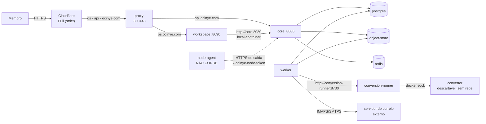

# Sistema actual — a verdade do terreno antes da generalização

Este documento descreve o Ocinye OS **tal como existe**, e não como se pretende
que venha a ser. É a Parte 0 do programa de generalização: antes de transformar
a instalação da Ocinye na primeira instância de um sistema operativo
auto-alojado de uso geral, fica escrito o que há, onde está, e o que depende de
quê. O destino está em [TARGET_OCINYE_OS.md](TARGET_OCINYE_OS.md); a evidência
da linha de base — SHAs, suites, falhas — em
[`docs/audits/pre-generalization-baseline/`](../audits/pre-generalization-baseline/README.md).

**Método.** Derivado do código e da configuração, não da prosa: `main @ 7c8441b`
lido ficheiro a ficheiro, produção observada só em leitura (release
`b4c95b6cdfe8`), e os números tirados de `./scripts/repository-facts.sh`. Onde a
documentação existente diz outra coisa, está assinalado em
[§15](#15-onde-a-documentação-e-o-sistema-divergem). **Verificado em
2026-09-26.**

A definição canónica do sistema continua a ser a de
[`README.md`](README.md#o-que-é-o-ocinye-os) desta pasta; este documento não a
redefine.

---

## 1. Identificação da linha de base

| Facto | Valor | Fonte |
|---|---|---|
| `BASELINE_SHA` | `7c8441b` (`main`) | `git rev-parse origin/main` |
| `PRODUCTION_SHA` | `b4c95b6cdfe8` | `/etc/ocinye/release.env` e etiquetas das imagens em execução |
| Esquema na árvore | `0051_member_app_pins` (51 migrations, 85 tabelas) | `repository-facts.sh` |
| Esquema em produção | `0051`, **derivado** — o release `b4c95b6` contém as 51 migrations e o Core aplica-as no arranque (`db::migrate`); a leitura directa de `_sqlx_migrations` em produção não foi feita | [baseline §1](../audits/pre-generalization-baseline/README.md#1-identificação) |
| Diferença `main` ↔ produção | só a #168 (testes de browser); nenhuma diferença de runtime | `git log b4c95b6..7c8441b` |

Contagens da árvore neste SHA, de `repository-facts.sh`: 211 caminhos e 251
operações no Core, 94 ecrãs no Workspace, 76 permissões, 71 ADRs, 1756 funções de
teste (638 com PostgreSQL).

## 2. Inventário de serviços

Em produção, um único host Ubuntu 24.04 (8 vCPU, 15 GiB RAM, 464 GB de disco)
corre um projecto Docker Compose `ocinye`
([`docker-compose.production.yml`](../../infra/compose/docker-compose.production.yml)),
arrancado por systemd ([`ocinye.service`](../../infra/systemd/ocinye.service)).

| Serviço | Imagem | Papel | Exposto | Privilégios |
|---|---|---|---|---|
| `proxy` | `nginx:1.27-alpine` | terminação TLS (Origin CA), roteamento por `server_name` | **80, 443** — a única porta pública | por omissão |
| `workspace` | `ocinye/ocinye-workspace:<sha>` | Experience: Leptos SSR + BFF | interno `8090` | utilizador `ocinye` (uid 10001) |
| `core` | `ocinye/ocinye-core-server:<sha>` | autoridade: API `/api/v1`, domínio, migrations | interno `8080` | uid 10001 |
| `worker` | `ocinye/ocinye-worker:<sha>` | outbox, extracção, miniaturas, ingestão de correio | — | uid 10001; **sem healthcheck** |
| `conversion-runner` | `ocinye/ocinye-conversion-runner:<sha>` | cria contentores descartáveis de conversão | — | **root**, com `/var/run/docker.sock` — o único |
| `converter` | `ocinye/ocinye-converter:<sha>` | imagem poppler/LibreOffice/ffmpeg; só construída | — | corre com `--network=none --read-only --cap-drop=ALL`, uid 65534 |
| `postgres` | `pgvector/pgvector:pg17` | estado autoritativo | — | — |
| `redis` | `redis:7-alpine` | coordenação efémera; fora do backup por desenho | — | — |
| `object-store` | `quay.io/minio/minio` (ver [§8](#8-dependências-externas)) | bytes dos ficheiros | — | — |
| `object-store-init` | `quay.io/minio/mc` | cria o bucket privado e sai | — | — |
| `backup` | `ocinye/ocinye-backup:<sha>`, perfil `backup` | cópia de continuidade, disparada por timer | — | root dentro da imagem |

Nenhum serviço declara `read_only`, `cap_drop`, `security_opt` nem rede própria:
todos partilham `ocinye_default`. O endurecimento existe só nos contentores
descartáveis de conversão ([ADR-0609](../adrs/0609-disposable-conversion-isolation.md)).
O `node-agent` existe como binário e **não corre em lado nenhum**: há zero nós.

## 3. Topologia de rede



- Os `server_name` estão escritos nas configurações do nginx
  (`20-ocinye-com.conf`, `30-os-ocinye-com.conf`, `40-api-ocinye-com.conf`); o
  `10-default.conf` responde `444` a tudo o resto.
- O IP real vem de `CF-Connecting-IP`, com `set_real_ip_from` gerado por
  `scripts/cloudflare-ranges.sh`. **Não há lista de permitidos** no origin: a
  protecção é o `default_server` e o certificado Origin CA, não um filtro de IP.
- A porta 80 serve sem redireccionar para HTTPS (a Cloudflare faz esse papel).
- A CSP do Workspace permite `fonts.googleapis.com` e `fonts.gstatic.com`: o
  browser do membro depende da Google Fonts.

## 4. Armazéns de dados

| Armazém | O que guarda | Autoridade | Viaja no backup |
|---|---|---|---|
| PostgreSQL 17 + pgvector | todo o estado institucional: 85 tabelas | Core (único escritor de domínio) | sim — `pg_dump -Fc` |
| Object storage S3-compatible | bytes de ficheiros, versões, miniaturas, avatares, anexos | Core; chaves opacas `{slug}/workspaces/…` e `{slug}/persons/…` | sim — `mc mirror` |
| Redis | presença, digitação, coordenação | nenhuma | **não**, por desenho |
| Memória do Workspace | sessões BFF (`SessionStore`) | Workspace | não — reiniciar o Workspace termina todas as sessões |
| `/etc/ocinye/*.env` | configuração e segredos de plataforma | operador | **não** — a raiz de selagem viaja à parte |
| Spool de conversão | ficheiros temporários | conversion-runner | não |

## 5. Fronteiras de confiança

| Fronteira | Autenticação | Autorização | Nota |
|---|---|---|---|
| Browser → Workspace | cookie `ocinye_session` (HttpOnly, SameSite=Lax, Secure em produção) | sessão BFF | o token do Core nunca chega ao browser |
| Workspace → Core | bearer da sessão do membro | o Core reautoriza em cada efeito | o Workspace esconde, o Core decide |
| Cliente directo → Core | bearer (`api.ocinye.com`) | idem | mesma política, mesmo gateway |
| Core → PostgreSQL | `OCINYE_DATABASE_URL` | total | um só utilizador de base; sem RLS |
| Core/Worker → object store | chave de acesso S3 em env | total sobre o bucket | sem endpoint público; o Core serve os bytes same-origin |
| Worker → conversion-runner | rede interna, sem autenticação | — | o runner é o único com `docker.sock` |
| Plano agentic → Core | Capability Executor | reautoriza contra o actor | nenhuma capability alcança SQL, shell, rede ou segredos |
| Node Agent → Core | token de enrolamento de uso único, depois token de agente de longa duração (só o digest SHA-256 fica na base) | só `enroll` e `heartbeat` | sem mTLS; o nó não recebe credenciais de base |
| Workspace/Core → correio externo | credencial institucional em env, ou credencial do membro **selada** | por caixa | TLS obrigatório |

## 6. Inventário de aplicações

O registo autoritativo é **dados Rust estáticos**:
`APPLICATIONS` em [`apps/workspace/src/ui/apps.rs`](../../apps/workspace/src/ui/apps.rs),
23 entradas, cada uma apoiada num `Screen` tipado. Não há activação por
instalação: todas as aplicações existem sempre, e a visibilidade decide-se por
permissão e, para quatro delas, por relevância de módulo.

| Categoria | Aplicações | Fixadas por omissão |
|---|---|---|
| Produtividade | Notas, Calendário, O Meu Trabalho, Home | Notas |
| Comunicação | Correio, Mensagens | — |
| Conhecimento | Ficheiros, Conhecimento, Bibliografia | Ficheiros |
| Investigação | Unidades, Ideias, Projectos, Datasets, Prompt, Ocinye AI, Agentes, Computação | Projectos |
| Administração | Recursos, Actividade, Administração, Audit Log, Definições, Ajuda | — |

A disponibilidade **não** vive no registo: cada ecrã consulta o Core em runtime
(`/mail/status`, `/ai/status`, `/ready`) e declara-se indisponível com a razão.
«Pesquisar» e «Perguntar» são ecrãs, não aplicações do registo.

## 7. Classificação do código

Todo o domínio vive num único crate (`ocinye-core`) e num único binário
(`core-server`), com um só `AppState` e um só pool. O router junta vinte
`routes()` de módulo em
[`services/core-server/src/routes/mod.rs`](../../services/core-server/src/routes/mod.rs)
sem nenhuma condição: **nenhum módulo se desliga**.

| Classe | Código |
|---|---|
| **CORE** | `identity` (pessoas, contas, credenciais, MFA, fixação de aplicações) · `organisation` (instituição, unidades, pertenças) · `governance` (auditoria, grants) · `resource` (perfis, entitlement, admissão) · `compute` (registo e autoridade de nós) · `audit`, `authn`, `authority`, `password` (incl. selagem), `operations`, `visibility`, `config` · `ocinye-domain::policy` · `ocinye-contracts` |
| **SYSTEM SERVICE** | `platform` (disponibilidade de capacidades) · `readiness` · `search` · `agentic` · `intelligence` (Gateway, router, conversas, embeddings) · `continuity` · `files` (fronteira de armazenamento e ficheiros institucionais) · `worker` · `conversion-runner` |
| **APPLICATION** | `knowledge` (bibliografia, notas, documentos) · `research` (ambientes, ideias, projectos) · `science` (hipótese → resultado, linhagem) · `data` (datasets) · `collaboration` (tarefas, comentários, actividade) · `calendar` · `messaging` · `mail` · todos os ecrãs do Workspace |
| **INFRASTRUCTURE** | `db`, `outbox`, `storage` (cliente S3 concreto), `realtime` · `infra/` (Compose, Dockerfiles, nginx, systemd) · `ocinye-observability` |
| **INTEGRATION** | `mail::imap_smtp` · `capabilities` (ponte para o runtime WASM) · `wasm/capabilities/bibtex-import` · `node-agent` |
| **LEGACY / DEBT** | alias `OCINYE_MAIL_KEY` e comando `mail-key` · caminho OIDC (`authn`, `people.oidc_subject`) ao lado da autenticação do Core · comentário de esquema que cita a ADR-0102 já substituída · `mail_provider_settings` na base sem uso em runtime · `StorageConfig`/`CoreConfig` com `derive(Debug)` sobre segredos |

A separação que a generalização precisa — Core que governa, aplicações que
implementam — **existe no vocabulário e nas regras de dependência entre crates,
mas não no deploy nem no router**: uma falha de compilação ou de arranque em
qualquer aplicação é uma falha do Core.

## 8. Dependências externas

| Dependência | Onde | Tipo | Estado |
|---|---|---|---|
| **MinIO (servidor e `mc`)** | object store, init, CI, backup | estratégica | **Retirada pelo fabricante.** As imagens desapareceram do quay.io e do Docker Hub, e `dl.min.io` responde `410`. Produção só funciona porque as imagens estão em cache no host. Ver [baseline](../audits/pre-generalization-baseline/README.md). |
| Cloudflare | DNS, borda, TLS de borda, Origin CA, tecto de ~100 MB por pedido | estratégica | activa |
| Docker Hub | `rust`, `debian`, `docker:27-cli`, `nginx`, `pgvector`, `redis` | técnica | activa |
| apt.postgresql.org, deb.debian.org, crates.io | build | técnica | activas |
| GitHub | origem do deploy, CI, advisories | técnica | activa |
| Servidor de correio (LWS) | IMAP/SMTP | integração | só em configuração e comentários; nenhum código específico |
| Google Fonts | CSP e browser | técnica | activa |
| Destino de backup S3 | `backup-remote.sh` | operacional | configurado fora do repositório |

## 9. Modelo de recursos

[ADR-0108](../adrs/0108-resource-governance-and-compute-control-plane.md):
capacidade, entitlement, reserva e uso são conceitos distintos, e acesso não é
entitlement.

- **Vocabulário tipado** (`ocinye-contracts::resource`): doze `ResourceType`
  (armazenamento, CPU, RAM, GPU, VRAM, tempo de GPU e de computação,
  concorrência, acesso a modelo, contexto, duração, ritmo) e cinco âmbitos
  (`Organization`, `Member`, `Unit`, `ResearchWorkspace`, `Project`).
- **Resolução do entitlement**: perfil por omissão (`MEMBER_STANDARD`) +
  substituições + concessões temporárias, com explicação por parcela.
- **Imposto hoje**: armazenamento pessoal (tranca por membro,
  `usado + a entrar ≤ limite`) e admissão de pedidos de IA contra
  `model_access`, com ledger imutável.
- **Não existe**: capacidade física, reservas persistidas, alocação por nó ou
  GPU, quotas por aplicação. CPU/RAM/GPU são vocabulário sem enforcement.

## 10. Modelo de segredos

- **Uma raiz de selagem**, `OCINYE_SEALING_KEY`, com subchaves HKDF-SHA256 por
  domínio (`ocinye/sealing/mail/v1`, `ocinye/sealing/mfa-totp/v1`) e
  ChaCha20-Poly1305 com byte de versão
  ([`sealed.rs`](../../crates/ocinye-core/src/password/sealed.rs)).
- **Selado na base**: credenciais de caixa de correio por membro e sementes TOTP.
  Verificadores Argon2id para palavras-passe e códigos de recuperação; digests
  SHA-256 para tokens de nó.
- **Em claro no ambiente** (`/etc/ocinye/*.env`): URL da base, chaves do object
  store, credencial institucional de correio, token de enrolamento do nó.
- **Não existe** um armazém genérico de segredos, rotação da raiz, revogação de
  segredos de fornecedor, nem metadados/auditoria de uso de segredos. Não há
  onde guardar uma chave de API de um fornecedor de IA.

## 11. Modelo de armazenamento

- `ObjectStore` é uma **struct concreta** sobre `aws_sdk_s3`, não um trait; o
  único backend é S3-compatible (`storage_backends.kind = s3_compatible`).
- O ficheiro é a unidade governada (identidade, versões imutáveis,
  classificação efectiva `most_restrictive(workspace, file)`); pastas arrumam e
  não decidem ([ADR-0204](../adrs/0204-institutional-files-and-folders.md)).
- Os bytes saem **same-origin pelo Core**
  ([ADR-0608](../adrs/0608-same-origin-institutional-downloads.md)); o bucket
  não tem endpoint público.
- Uploads grandes vão por partes; o tecto de ~100 MB por pedido é da borda
  Cloudflare, não do produto.

## 12. Modelo de IA

- **Contrato**: `trait InferenceProvider` com prazo, versão de contrato e limite
  de resposta ([ADR-0304](../adrs/0304-canonical-inference-contract.md)); envelope
  tipado `origin · status · reason_code`
  ([ADR-0308](../adrs/0308-typed-ai-interaction-envelope.md)).
- **Em produção o fornecedor está fixo no código**:
  `inference: Arc::new(NoProvider)` em `core-server/src/main.rs`. Não há nenhum
  adapter real nem SDK de fornecedor na árvore; o `FixtureProvider` só compila
  com a feature `test-fixtures`.
- **Capacidades**: `GENERAL`, `CODING`, `REASONING`, `EMBEDDING`.
- **Registo de modelos**: a tabela `ai_models` **é** o registo, e só o heartbeat
  de um nó a escreve (apaga e reinsere o inventário). O esquema admite
  `provider_kind = external`, mas nenhum caminho o insere. Não existe registo de
  fornecedores.
- **Roteamento**: filtra por capacidade e por `provider_kind`
  (`OCINYE_AI_ALLOW_EXTERNAL_PROVIDERS=false` exclui o externo), respeita
  `OCINYE_AI_CAPABILITY_MAP` se existir, e escolhe o primeiro candidato. «Zero
  candidatos» é um resultado tipado.
- **Egress por classificação**: tecto `INTERNAL` para inferência externa,
  `CONFIDENTIAL` para local, `RESTRICTED` nunca; limitado ainda pelo
  `max_classification` do modelo e do agente. No Gateway, `local_inference` está
  fixo a `false`.
- **Estado**: 0 nós, 0 fornecedores, 0 modelos. O Prompt conclui sempre
  `SYSTEM`/`DEGRADED` com `AI_NO_PROVIDER_AVAILABLE`.

## 13. Modelo de deploy

[`scripts/deploy-production.sh`](../../scripts/deploy-production.sh), corrido da
máquina de quem desenvolve:

```text
árvore limpa → git archive de origin/main → sha256 confirmado no servidor
→ extrair em /srv/ocinye/releases/<sha> → instalar confs do nginx → reload
→ docker compose build no host (imagens etiquetadas pelo SHA)
→ symlink current → release.env → up -d
```

- **Sem portão de saúde** (termina num `ps`), sem backup prévio, sem verificação
  de pré-condições no host, sem limpeza de releases ou de cache de build (237 GB
  de cache de build no host, 227 GB recuperáveis).
- **Migrations aplicam-se no arranque do Core** e não têm reversão.
- **Rollback** ([`rollback-production.sh`](../../scripts/rollback-production.sh))
  troca o symlink e espera pela saúde do Core. **Não funciona através de uma
  migration**: o sqlx recusa arrancar um Core mais antigo contra uma base com uma
  migration que ele não conhece (`VersionMissing`, `ignore_missing` nunca é
  activado). Também não repõe as confs do nginx do release anterior.
- O host, o utilizador SSH, a chave e os caminhos estão escritos nos scripts.
- **Não existe instalador**: preparar um host novo (utilizador, Docker, ficheiros
  `/etc/ocinye/*.env`, TLS, intervalos Cloudflare, unidades systemd) não está
  escrito em lado nenhum.

## 14. Modelo de backup

- `institutional-backup.sh`: manifesto do Core (`snapshot`), `pg_dump -Fc`,
  espelho dos objectos, `SHA256SUMS`, cifra `age` para um destinatário público, e
  envio para um destino S3 com confirmação por leitura de volta. Retenção local e
  remota por `OCINYE_BACKUP_KEEP`.
- A raiz de selagem **não** viaja no conjunto; a chave privada `age` **não** está
  no servidor.
- Restauro: `institutional-restore.sh` decifra, verifica, recusa uma base não
  vazia e faz `pg_restore`; os objectos repõem-se por um comando do operador.
  `institutional-verify.sh` corre as três verificações de continuidade.
- **Em produção o agendador está instalado** (`ocinye-backup.timer`, diário às
  03:00) — e **falha**: a imagem de backup reconstrói-se depois de cada deploy e
  descarrega o `mc` de `dl.min.io`, que responde `410`. Ver
  [baseline](../audits/pre-generalization-baseline/README.md).

## 15. Onde a documentação e o sistema divergem

| Afirmação | Onde | Realidade |
|---|---|---|
| «Nenhum backup periódico existe», «o agendador não está instalado em lado nenhum» | `CLAUDE.md` §1, `docs/backups/README.md` | o timer está instalado em produção — e falha |
| `main` protegida com cinco *required checks* e `enforce_admins` | `CLAUDE.md` §1, §73 | a API devolve zero *required checks* e `enforce_admins: false`; os merges recentes entraram com `--admin` |
| 205 caminhos, 243 operações, 93 ecrãs, 49 migrations, 84 tabelas | `CLAUDE.md` §1 | 211, 251, 94, 51, 85 |
| «Runbook de rollback: por escrever» | `docs/deployment/README.md` | existe; e o runbook diz que o rollback é seguro com migrations aditivas, o que o código contradiz |
| O stack de desenvolvimento traz Core, Worker e Workspace | cabeçalho de `infra/compose/docker-compose.yml` | só traz postgres, redis, minio e minio-init |
| O registo de aplicações detém a disponibilidade | `CLAUDE.md` §45-A | o `Application` não tem campo de disponibilidade; cada ecrã consulta o Core |
| Imagem MinIO fixada em `RELEASE.2025-04-22T22-12-26Z` | `docker-compose.production.yml` | em produção essa etiqueta aponta para a imagem `latest` de 2025-09-07, reetiquetada no host |

## 16. Pressupostos de uma só organização

O esquema já é explícito sobre a instituição: a tabela `organisations` existe
desde a migration 0001 («single-tenant today; modelled explicitly so scope is
never implicit»), `organisation_id` atravessa 22 migrations, e `can()` recusa
acesso entre organizações. O que prende o sistema **à Ocinye** é outra coisa:

| Pressuposto | Onde | Natureza |
|---|---|---|
| `OCINYE_ORGANISATION_SLUG` por omissão `ocinye`; nome = slug no bootstrap | `config.rs`, `bootstrap.rs`, `main.rs` | identidade da organização |
| Prefixo das chaves de objecto é o slug | `storage.rs` | identidade → dados; mudar o slug órfã os objectos |
| Assinatura de correio: «Ocinye», logótipo compilado no binário | `mail/signature.rs` | identidade da organização |
| Emissor TOTP `"Ocinye"` | `routes/auth.rs` | identidade da organização |
| Quatro unidades semeadas (UAI, UCS, UDC, UID) em toda a organização e em todo o bootstrap | migration 0049, `organisation/service.rs` | estrutura de investigação da Ocinye |
| `research_workspaces` exige unidade; tarefas, datasets, fontes e documentos exigem ambiente | migrations 0002–0005 | investigação como estrutura do núcleo |
| Papéis `ResearchLead`/`ResearchMember`, posições de investigação, relevância de módulos por papel de investigação | `roles.rs`, `relevance.rs` | investigação como estrutura do núcleo |
| Home centrada em ideias, projectos, unidades e datasets; 5 de 7 itens do «+ Criar» | `home.rs`, `shell.rs` | perfil de investigação implícito |
| Nome de reserva «Ocinye» no topo; marca «OCINYE OS / WORKSPACE» | `routes.rs`, `shell.rs` | produto (aceitável) e organização (não) |
| Domínios `ocinye.com`, IP do host, chave SSH pessoal | nginx, scripts de deploy | deploy |
| Literais em português fora do catálogo: ~22 na shell, ~66 títulos de página, todas as mensagens do Core, o selo «ESTADO» do Prompt | `shell.rs`, `routes.rs`, módulos do Core | i18n incompleto |
| Idioma só em cookie; não persiste no Core | `/settings/language` | preferência por browser |
