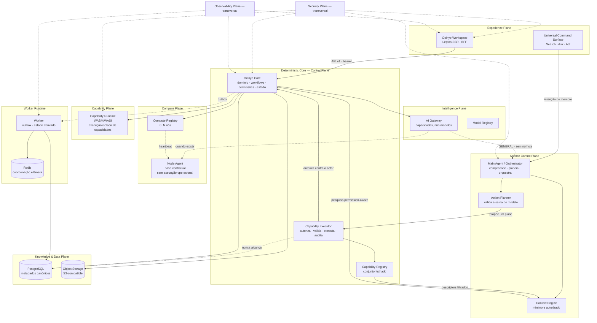
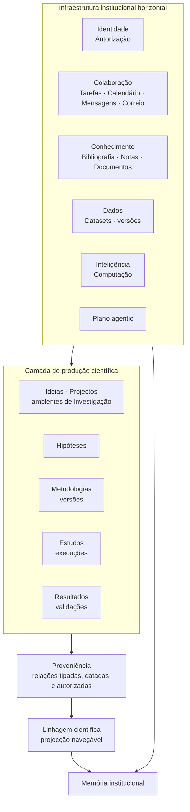
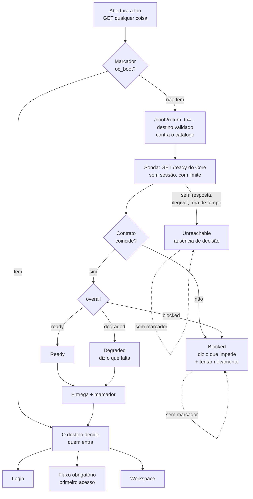
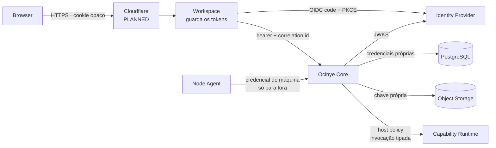

# Arquitectura do Ocinye OS

Esta página é a **fonte canónica** da definição do Ocinye OS, dos seus planos e
das suas fronteiras de autoridade. Os outros documentos resumem e ligam para
aqui; não redefinem.

## O que é o Ocinye OS

> **O Ocinye OS é a infraestrutura digital institucional através da qual a
> Ocinye organiza, governa, preserva e transforma conhecimento, dados,
> investigação e engenharia em capacidade tecnológica duradoura.**

Não um website com área privada. Não uma colecção de aplicações internas. Não uma
plataforma de IA. A decisão que recusa esse caminho está em
[ADR-0001](../adrs/0001-ocinye-os-definition.md); esta secção é a formulação
corrente do que ela produziu.

**A Ocinye** é uma instituição angolana de investigação aplicada, engenharia e
infraestruturas tecnológicas. **O Ocinye OS** é a sua infraestrutura digital
institucional. Não se confundem: a instituição tem existência própria, e o
sistema existe para a suportar.

### Porque existe

> **People may leave. Projects may end. Software may be replaced. AI models may
> change. Institutional knowledge must remain.**

Investigadores saem. Projectos terminam. Equipamentos mudam. Financiamentos
acabam. Software é substituído, e modelos de IA são trocados por outros melhores.
A resposta por omissão a cada uma dessas necessidades é construir mais uma
aplicação — e ao fim de alguns anos a instituição tem sete sistemas que não se
conhecem e nenhuma memória.

> **Ocinye OS should preserve institutional knowledge independently of the
> continued presence of any individual member, software implementation, AI model
> or compute node.**

E daí a finalidade, que não é a de preservar software:

> **The purpose of Ocinye OS is not to preserve software. It is to preserve and
> amplify the institution's capacity to know, investigate, engineer and build.**

### As quatro propriedades que decorrem disto

**A inteligência artificial é uma capacidade transversal do sistema.** Aumenta a
capacidade de compreender, investigar, simular, criar e operar — e não substitui
a autoridade institucional, a evidência científica nem a memória da organização.

> **AI is a transversal capability, not the institutional substrate.**

**A proveniência científica é uma propriedade fundamental.** Resultados
relevantes permanecem rastreáveis às pessoas, dados, métodos, versões,
ferramentas, execuções e evidências que os produziram
([ciclo de vida científico](scientific-lifecycle.md)).

**A autoridade institucional reside no Core, e nada a partilha.** É a fronteira
que a secção [Core, Experience e Design System](#core-experience-e-design-system)
descreve.

**A instituição sobrevive ao servidor onde corre.** Um servidor é uma instância
de execução, e não a fonte de verdade da instituição só porque contém
fisicamente o disco onde o PostgreSQL está instalado.

> **Infrastructure may be replaced. Institutional state must survive.**

Isto é arquitectura, e não administração de sistemas: a resposta a «o que é
preciso levar?» não se descobre a olhar para o servidor, mas a olhar para o que
o domínio considera estado autoritativo — e essa é uma decisão do Core
([ADR-0700](../adrs/0700-institutional-continuity-and-portability.md)). Um
`pg_dump` salva a base; não salva os bytes a que ela aponta, nem a chave sem a
qual parte das linhas é ilegível.

Estas distinções não são retóricas. Determinam o modelo de dados (proveniência
desde o início, não acrescentada anos depois), a autorização (contextual, não
`admin`/`user`), a pesquisa (permission-aware em SQL, não filtrada no cliente), a
evolução (zero ou N nós, sem reconstrução) e a continuidade (identidades que
sobrevivem à mudança de máquina, e verificação de que sobreviveram).

## Duas dimensões, dois diagramas

O Ocinye OS lê-se por duas perguntas diferentes, e cada uma tem o seu diagrama.
Juntá-las num só produziria um esquema que não responde a nenhuma.

| Pergunta | Onde está a resposta |
|---|---|
| **Quem pode produzir efeitos?** | [Planos](#planos) e [Core, Experience e Design System](#core-experience-e-design-system) |
| **Para que serve o sistema?** | [Infraestrutura horizontal e produção científica](#infraestrutura-horizontal-e-produção-científica) |

## Planos



**Linhas tracejadas são `PLANNED`, assíncronas, ou — no caso de
`EXEC -.-> PG` — deliberadamente inexistentes.**

A seta que define esta arquitectura é `PLN → EXEC`: o plano agentic **propõe**,
e o Capability Executor decide. Não existe caminho de `MA` para `PG`, nem para
o object storage, nem para a rede. Um agente alcança a instituição pela mesma
porta que uma rota HTTP: um serviço de domínio que detém a invariante
([ADR-0301](../adrs/0301-agentic-control-plane.md),
[ADR-0303](../adrs/0303-capability-registry-and-executor.md)).

Nenhum nó de IA existe, pelo que `GW → MA` não serve nada hoje: `Ask` e `Act`
declaram-se indisponíveis e `Search` responde sem modelo.

## Core, Experience e Design System

Os planos acima descrevem o que o sistema **faz**. Esta secção descreve quem
tem autoridade para o fazer, e é uma fronteira de confiança antes de ser um
arranjo de pastas.

```text
OCINYE OS
│
├── OCINYE CORE
│   Autoridade institucional
│
│   ├── Identity
│   ├── Authorization & Policy
│   ├── Domain
│   ├── Core Operations
│   ├── Persistence
│   ├── Audit
│   └── Readiness
│
├── OCINYE EXPERIENCE
│   Interacção humana e apresentação
│
│   ├── Workspace Shell
│   ├── Boot
│   ├── Navigation
│   ├── Native Screens
│   └── Interaction
│
└── OCINYE DESIGN SYSTEM
    Consistência visual e interactiva

    ├── Ocinye Default Theme
    ├── Semantic Tokens
    ├── Components
    ├── Icons
    ├── Motion
    ├── Focus
    └── Accessibility
```

O Design System **não está entre** o Core e a Experience. Não é intermediário
de nada: é uma dependência de apresentação, do lado da Experience, e o Core não
sabe que ele existe.

### As cinco regras

> **O Core detém a verdade institucional e a autoridade.**

> **A Experience detém a apresentação e a interacção humana.**

> **O Design System detém a consistência da apresentação, nunca a autoridade do
> domínio.** Um `StatusBadge` sabe desenhar `warning`; não sabe o que significa
> um evento cancelado.

> **A Experience alcança efeitos institucionais apenas através dos contratos
> suportados e da camada de cliente.**

> **Um módulo nativo pode estender o Ocinye OS; não pode criar uma segunda
> autoridade, uma segunda shell ou uma segunda linguagem visual.**

Duas consequências que valem a pena dizer por extenso, porque são as que se
perdem primeiro:

**O Core tem de continuar utilizável sem o Workspace.** Não há nada em
`ocinye-core` que precise de saber que existe um browser, uma folha de estilos
ou um ecrã. Um `TemporalError::NonexistentLocalTime` é o que o Core devolve; «esta
hora não existe nesta zona horária devido à mudança de hora» é o que a Experience
decide dizer.

**O Workspace tem de continuar incapaz de se tornar autoridade.** Ele pode
esconder um botão que sabe ser inútil — isso é cortesia com quem o usa. O que
não pode é concluir que a operação está autorizada, porque então existem duas
respostas para a mesma pergunta e um dia discordam. O Core reautoriza sempre no
efeito.

### Dependência de produção não é dependência de teste

O `ocinye-workspace` depende do `ocinye-core-server` — **em testes**. O harness
de browser levanta um Core a sério, em processo, e é assim que se prova que uma
pessoa consegue usar o produto.

Isso não é uma excepção à fronteira; é outra classificação. O binário enviado
não leva o Core consigo, e uma dependência permitida para integração **não
autoriza a sua promoção a runtime**. As duas leem-se com o mesmo nome e
significam o oposto, e é por isso que a promoção é verificada em separado.

### O que é imposto, e onde

| Propriedade | Onde é provada |
|---|---|
| Arestas entre crates são uma lista de permitidos | `scripts/architecture_boundaries.py` |
| Produção e teste são classificações distintas | idem, com verificação de promoção |
| A Experience não liga persistência | idem, lista de permitidos das dependências de produção |
| Um ecrã não escreve o caminho de um endpoint | `apps/workspace/tests/experience_boundary.rs` |
| Um ecrã não alcança transporte nem persistência | idem |
| Um ecrã não importa o avaliador de políticas | idem |
| O analisador observa o ficheiro inteiro | idem — a convenção do módulo de teste é imposta, não suposta |
| Cores, camadas, movimento e foco vêm de tokens | `apps/workspace/tests/design_fidelity.rs` |

A defesa é em profundidade e as duas metades respondem a perguntas diferentes.
O grafo torna a dependência proibida **impossível de escrever**; o guarda léxico
apanha a implementação proibida dentro de uma dependência que é permitida.

### E quem verifica os verificadores

`scripts/harness-integrity.sh` corre **antes** de todos os outros, e prova que
se pode confiar neles: que um processo falhado não passa por imprimir a palavra
certa, que sair bem sem produzir prova é `INVALID` e não `PASS`, que um portão
em falta não conta como passado, e que um verificador que altere código
versionado falha mesmo restaurando-o a seguir.

Existe por causa de um incidente, e vale a pena registá-lo.

> **2026-08-25.** Durante esta consolidação, uma versão inicial do harness de
> comparação visual alterava temporariamente a folha de estilos versionada para
> a comparar com o estado anterior. Uma execução deixou-a na versão base, e um
> commit seguinte capturou-a assim — revertendo parte da tokenização.
>
> Os guardas de design eram capazes de detectar a regressão. O que falhou foi a
> ordem e a leitura: a verificação parou num aviso do compilador antes de lhes
> chegar, e um pipeline de shell devolveu o estado do `grep` final em vez do
> estado do verificador, transformando uma execução falhada em «passou».
>
> O harness foi refeito para ser apenas de leitura e correr isolado, a
> propagação de falhas foi endurecida com quatro estados — `PASS`, `FAIL`,
> `INVALID`, `NOT_RUN`, e só o primeiro é verde — e a integridade das próprias
> ferramentas de verificação passou a ser um portão explícito.

A regra que daí sai é transversal:

> **A ausência de prova nunca é prova de sucesso.**

Um verificador só é evidência quando se pode demonstrar que observou o objecto
certo, exerceu a violação certa e falhou pela razão esperada. Qualquer outro
desfecho é `INVALID` — nunca «passou».

## Infraestrutura horizontal e produção científica

Os planos acima respondem a *quem pode produzir efeitos*. Esta secção responde a
*para que serve o sistema*, e organiza-o noutro eixo: o que é infraestrutura para
toda a instituição, e o que é produção de conhecimento.



**A infraestrutura horizontal serve toda a instituição.** Identidade,
autorização, colaboração, conhecimento, dados, correio, calendário, mensagens,
inteligência e computação não são domínios científicos: são o substrato sobre o
qual qualquer trabalho institucional acontece. O correio, as mensagens e o
calendário são módulos nativos desta camada
([ADR-0003](../adrs/0003-native-modules.md)) — não o centro conceptual do
sistema.

**A camada científica produz conhecimento.** É onde uma pergunta se torna
hipótese, a hipótese se torna estudo, o estudo corre e produz resultado, e o
resultado é validado ou reproduzido.

**A proveniência liga as duas.** Cada relação é tipada, datada, autorizada e
guarda se foi observada pela operação ou declarada por alguém. A linhagem é a
projecção navegável dessas relações — não uma segunda base de dados.

**A memória institucional emerge**, e não é um módulo: nasce da composição
governada do conhecimento, dos dados, dos projectos, dos resultados, dos
documentos, da auditoria e da proveniência.

Detalhe: [ciclo de vida científico, proveniência e linhagem](scientific-lifecycle.md).

### Comunicação não é conhecimento

Um email, uma mensagem ou uma reunião não se tornam automaticamente evidência
científica, conhecimento institucional ou proveniência. A promoção é deliberada e
passa por uma operação: alguém decide que aquilo passa a fazer parte do registo
institucional, e essa decisão fica registada como qualquer outra.

## Onde vive cada plano

| Plano | Implementação | Estado |
|---|---|---|
| Experience | `apps/workspace` | `CURRENT` (SSR); hidratação `PLANNED` |
| Agentic Control | `ocinye-core::modules::agentic`, `ocinye-domain::policy::agentic` | `CURRENT`; inferência `NO_RESOURCE` |
| Control | `crates/ocinye-core`, `services/core-server` | `CURRENT` |
| Knowledge & Data | `ocinye-core::modules::{knowledge,data,search}` + PostgreSQL + MinIO | `CURRENT` |
| Produção científica | `ocinye-core::modules::science` | `CURRENT`; linhagem com tecto de 5 saltos |
| Intelligence | `ocinye-core::modules::intelligence` | `CURRENT` (arquitectura); 0 fornecedores |
| Compute | `ocinye-core::modules::compute`, `services/node-agent` | `CURRENT` (registo); 0 nós |
| Capability | `crates/ocinye-capabilities`, `wasm/capabilities` | `CURRENT`; primeiro consumidor: `knowledge::review_bibliography` |
| Security | `ocinye-domain::policy`, `ocinye-core::audit` | `CURRENT` |
| Observability | `ocinye-observability` | `CURRENT` |

### Duas coisas chamam-se «capability», e não são a mesma

O vocabulário colide, e a colisão custa a quem lê pela primeira vez:

- **Capability Registry** e **Capability Executor** são o conjunto fechado de
  operações que um agente pode invocar, e o sítio onde essa invocação é
  autorizada, validada, executada e auditada. Estão ligados e em uso.
- **Capability Runtime** é o isolamento WebAssembly/WASI onde uma transformação
  sobre artefactos corre — com limite de combustível e de tempo, sem rede, sem
  sistema de ficheiros que não tenha pedido. O primeiro consumidor operacional é
  `knowledge::review_bibliography`.

A primeira concede acesso a operações; a segunda executa código isolado. Um
agente atravessa a primeira em cada acção; à segunda **nunca chega
directamente**, porque quem escolhe e invoca o componente é o Core.

O caminho é sempre o mesmo, venha de onde vier o pedido:

```text
Experience  →  Core  →  Capability Runtime
Agentic     →  Core  →  Capability Runtime
```

Nem a Experience nem o plano agentic dependem de `ocinye-capabilities`, e o
portão de fronteiras recusa uma aresta que o tentasse.

## O arranque

Abrir o Ocinye OS não é abrir uma página. É atravessar uma decisão que já foi
tomada: **o Workspace não se apresenta pronto antes de o Core determinístico ter
estabelecido a prontidão institucional.**



Quatro coisas que este desenho decide, e que são fáceis de perder de vista:

**A decisão é do Core, e é feita uma vez.** O Workspace não conta componentes
verdes para chegar a uma conclusão própria. Contar no browser seria uma segunda
política de arranque, e duas políticas acabam por discordar.

**Bloqueado e sem resposta são estados diferentes.** Um Core que decidiu que não
pode servir disse alguma coisa; um Core que não respondeu não disse nada.
Fundi-los faria a interface afirmar uma decisão que ninguém tomou. `Unreachable`
existe só do lado da Experience, e por isso mesmo: não é um `ReadinessOverall`,
é a ausência de um.

**O arranque não consulta a sessão.** Entrega ao destino; é o destino que decide
quem entra. É o que faz um fluxo obrigatório — mudar a palavra-passe no primeiro
acesso — sobreviver a um destino profundo aberto a frio.

**O marcador é estado de apresentação, e mais nada.** Dispensa o Splash na mesma
janela. Não autentica, não autoriza, e não faz um Core bloqueado parecer pronto:
a sonda corre na mesma.

Detalhe e razões: [ADR-0603](../adrs/0603-boot-and-institutional-readiness.md).

## Trust boundaries

Nenhuma rede é tratada como confiável por ser interna.



| Fronteira | Autenticação | Autorização | Validação |
|---|---|---|---|
| Browser → Workspace | Cookie de sessão opaco | Sessão do lado do servidor | CSP sem `unsafe-inline`, `SameSite`, e `Origin` verificado em escritas |
| Workspace → Core | Bearer OIDC | Política do Core | Schemas e DTOs |
| Core → IdP | — | — | Verificação JWKS: assinatura, `iss`, `aud`, `exp` |
| Core → PostgreSQL | Credenciais próprias | Predicado de autorização na query | SQL parametrizado |
| Core → Object Storage | Chave própria | URL assinada de curta duração | Allow-list de tipos, checksum |
| Core → Capability Runtime | — | Manifesto ∩ política | Limites de fuel, memória, tempo |
| Node Agent → Core | Credencial de máquina | Só liveness e relato | Payload tratado como hostil |

Detalhe: [docs/security/](../security/README.md) e
[docs/threat-model/](../threat-model/README.md).

## Decisões arquitecturais

O índice completo está em [docs/adrs/](../adrs/README.md). As que mais moldam o
resto:

- [ADR-0004](../adrs/0004-rust-first.md) — Rust-first como princípio da instituição.
- [ADR-0006](../adrs/0006-modular-monolith.md) — modular monolith com fronteiras explícitas.
- [ADR-0100](../adrs/0100-authorization-model.md) — RBAC + ABAC contextual, fail closed.
- [ADR-0010](../adrs/0010-events-outbox.md) — outbox transaccional.
- [ADR-0300](../adrs/0300-ai-gateway.md) — capacidades, nunca modelos.
- [ADR-0500](../adrs/0500-compute-registry-node-agent.md) — 0..N nós, identidade de máquina.
- [ADR-0501](../adrs/0501-capability-runtime-wasm.md) — WASM onde ganha o seu lugar.
- [ADR-0307](../adrs/0307-dual-entry-single-authority.md) — Dual Entry, Single Authority, e as quatro classes de fronteira.
- [ADR-0412](../adrs/0412-scientific-lifecycle-and-provenance.md) — ciclo de vida científico e proveniência de primeira classe.

## Como isto evolui sem ser reconstruído

| Passo | O que muda |
|---|---|
| Ligar `CAM-01` | Registar um nó; o agente enrola-se; `OCINYE_AI_CAPABILITY_MAP` passa a mapear capacidades. **Sem alterações de código.** |
| Segundo nó | Outra linha no registo. O modelo já é 0..N. |
| Storage próprio | Registar um backend, marcar `migration_planned`, migrar objectos com verificação de checksum, repontar, marcar `stable`. **Sem alterações no domínio.** |
| Pesquisa semântica | Produzir embeddings; a coluna `vector(1024)` já existe; acrescentar índice ANN por migration. |
| Extrair um módulo | As fronteiras de `mod.rs` já são a superfície de extracção. |
