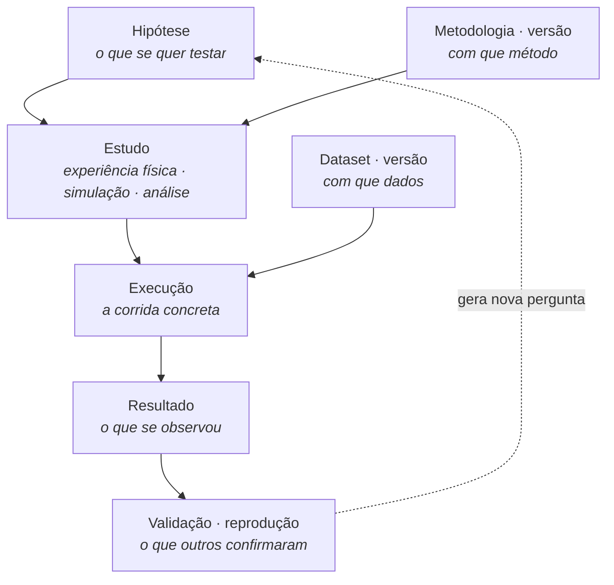

# Ciclo de vida científico, proveniência e linhagem

Esta página é a **fonte canónica** de quatro conceitos do Ocinye OS: o ciclo de
vida científico, a proveniência, a linhagem científica e a memória
institucional. Os outros documentos resumem-nos e ligam para aqui; não os
redefinem.

A decisão que os introduziu está registada em
[ADR-0412](../adrs/0412-scientific-lifecycle-and-provenance.md). Esta página
descreve o que está implementado.

---

## Porque existe esta camada

O Ocinye OS tinha ideias, projectos, bibliografia, notas, documentos e datasets.
Não tinha o que fica **entre** uma ideia e um dado: o que se quis testar, com que
método, em que corrida, e o que daí saiu.

Sem isso, a pergunta que sustenta um sistema de registo institucional — *que
trabalho produziu este resultado?* — não tinha resposta. Havia uma tabela de
relações, e uma pessoa podia declarar que um documento se relacionava com um
dataset. **Uma declaração não é proveniência.**

---

## Os objectos

Sete, cada um com identidade e ciclo próprios.

| Objecto | O que é |
|---|---|
| `Hypothesis` | Uma afirmação que se pode testar |
| `Methodology` | A identidade conceptual durável de um método |
| `MethodologyVersion` | O que esse método diz numa altura concreta |
| `Study` | Um estudo que põe a hipótese à prova |
| `StudyExecution` | Uma corrida concreta desse estudo |
| `Result` | O que a corrida mostrou |
| `ResultValidation` | A evidência de que alguém validou ou reproduziu |

### Um estudo, três géneros

`Study` tem um género fechado: **experiência física**, **simulação** ou
**análise**. Não existe uma entidade `Experiment` separada, e não vai existir.

Os três partilham tudo o que importa a esta camada: pertencem a um ambiente,
testam uma hipótese, seguem um método, consomem dados, executam-se e produzem
resultados. O que os distingue — bancada, malha, série temporal — é detalhe de
cada disciplina. Três tabelas obrigariam a triplicar cada consulta de linhagem, e
a decidir em qual procurar antes de saber o que se procura.

### A versão é um recurso

`MethodologyVersion` e `DatasetVersion` não são campos. São recursos, e a
proveniência aponta para eles.

```text
Methodology  «Medição a quatro pontas»
    └── MethodologyVersion  v2      ← é isto que a proveniência cita

Dataset      «SCADA Parque A»
    └── DatasetVersion      v4      ← e isto
```

É o que torna a proveniência honesta no tempo: um resultado produzido com a
versão 2 continua a dizer «versão 2» depois de a versão 5 existir. Uma aresta
para a metodologia passaria a descrever outra coisa no dia em que alguém a
melhorasse — sem que ninguém a alterasse, e sem que nada o dissesse.

**Uma versão publicada não se reescreve.** Publicar uma versão nova substitui a
que estava em vigor: a anterior fica, marcada como substituída, e continua a
valer para tudo o que já a citou.

---

## O ciclo, e o que ele não é



> **O ciclo de vida científico representa relações possíveis e rastreáveis de
> produção de conhecimento. Não é um workflow linear obrigatório.**

A ciência volta atrás. Uma execução repete-se. Um resultado gera uma hipótese
nova. Um estudo pode não testar hipótese nenhuma, e um resultado pode não vir de
execução conhecida. O Core mantém as invariantes; a interface apresenta relações
e contexto, e não um assistente de quinze passos.

### Um resultado negativo é um resultado

Uma hipótese refutada, uma validação que contradisse, uma execução que falhou —
tudo isto é memória institucional válida, e o vocabulário do domínio representa-o
explicitamente. Um sistema que só saiba registar sucessos não regista ciência.

### O que um `Result` **não** é

| | |
|---|---|
| **Result** ≠ **Publication** | Publicar é um desfecho posterior e possível |
| **Result** ≠ **Prototype** | Um resultado é evidência; um protótipo é artefacto |
| **Result** ≠ **Validation** | A validação é uma avaliação **sobre** o resultado |

### Ciclo científico ≠ ciclo do projecto

O ciclo do projecto — estados, membros, planeamento — é administração e operação.
O ciclo científico é a produção de conhecimento e de evidência. Coexistem no mesmo
ambiente de investigação e não se substituem: reduzir investigação ao estado de um
projecto perde exactamente o que esta camada existe para guardar.

---

## Proveniência

> **Proveniência responde: de onde veio este resultado?**
>
> **Auditoria responde: o que aconteceu no sistema?**

São coisas diferentes e não se substituem. A auditoria regista actos — quem fez o
quê, quando, com que desfecho. A proveniência regista **derivação** — de que
dados, versões, métodos, estudos e execuções deriva um resultado.

Um registo de auditoria completo não responde à pergunta científica, e uma
proveniência completa não responde à pergunta operacional.

### Onde vive

Em `research_links`, a mesma tabela que já guardava as relações entre artefactos
de investigação. Não há tabela de proveniência paralela: duas tabelas para o mesmo
conceito dão duas respostas à mesma pergunta, e a divergência aparece no dia em
que alguém precisa da certa.

### Relações tipadas, e uma matriz que recusa

Uma relação só existe se a tripla **tipo de origem + verbo + tipo de destino** for
permitida. Um estudo segue uma *versão* de metodologia e nunca a metodologia; uma
*versão* de dataset entra numa execução e nunca o dataset. A matriz falha fechada:
o que não está explicitamente permitido é recusado.

O vocabulário é fechado e vive em
[`crates/ocinye-contracts/src/provenance.rs`](../../crates/ocinye-contracts/src/provenance.rs),
que é a fonte — esta página não repete a matriz.

### As duas origens

Cada aresta guarda de onde veio:

| `origin` | O que significa |
|---|---|
| `operation` | O Core **observou** a relação: foi a operação determinística que a produziu |
| `declared` | Alguém **afirmou** a relação, através de uma operação autorizada |

Não existe uma terceira origem. Em particular, não existe `model`: a inferência de
um modelo não é uma origem de proveniência institucional.

### Proveniência transaccional

As relações que a própria operação conhece são escritas na mesma transacção que
produz o efeito, com `origin = operation`. Quem regista um resultado dentro de uma
execução nunca declara depois que aquela execução o produziu — a operação viu-o.

Escritas hoje pelas operações do Core:

| Operação | Aresta |
|---|---|
| `science::create_study` | `Study → tests → Hypothesis` |
| `science::create_study` | `Study → follows → MethodologyVersion` |
| `science::record_execution` | `StudyExecution → follows → MethodologyVersion` |
| `science::record_execution` | `DatasetVersion → input_to → StudyExecution` |
| `science::create_result` | `Result → produced_by → StudyExecution` |
| `science::publish_methodology_version` | `MethodologyVersion → supersedes → MethodologyVersion` |

Cada uma só é escrita quando a operação recebeu o recurso correspondente, e cada
recurso é resolvido com a política de quem age antes de qualquer aresta: um
identificador nomeia âmbito, não o concede.

### A IA e a proveniência

> **AI may suggest provenance. AI may not assert institutional provenance merely
> by inference.**
>
> **Model inference is not institutional provenance.**

Um agente pode propor uma relação, e essa proposta atravessa a mesma operação
autorizada que uma pessoa atravessaria — e fica marcada `declared`, porque foi
afirmada. Nenhum caminho agentic escreve `operation`: esse valor pertence às
operações que observaram o facto.

---

## Linhagem científica

> **A linhagem científica é a projecção navegável das relações de proveniência
> que permite compreender de onde veio um recurso científico e o que
> posteriormente dependeu dele.**

> **Scientific Lineage is derived from recorded provenance. It is a navigational
> projection of institutional evidence, not an independent source of truth.**

Não há tabela de linhagem, não há grafo paralelo, não há cache. Cada travessia lê
`research_links` e os recursos que ela nomeia, agora. Guardar o grafo para
acelerar a interface criaria uma segunda fonte de verdade — e duas fontes de
verdade acabam por discordar, normalmente no dia em que alguém precisa da resposta
certa.

E fica em PostgreSQL. As relações são linhas tipadas e a travessia é uma
sequência de consultas; nada disto pede uma base de dados de grafos.

### Montante e jusante

| | |
|---|---|
| **Montante** | De que depende isto? |
| **Jusante** | O que passou a depender disto? |

É o vocabulário do Workspace, e é o mesmo aqui de propósito.

### A linhagem respeita autorização em cada salto

Cada nó é resolvido pelo serviço que o detém, com a política de quem percorre.

> **Uma fronteira de autorização escondida tem de ser indistinguível de uma folha
> visível.**

Se um nó intermédio não é legível, **a travessia termina nessa fronteira**. Não se
atravessa por trás dele, e não se devolve nada sobre ele: nem identificador, nem
tipo, nem título, nem ambiente, nem uma contagem que confirme que existe.

A forma do grafo é ela própria informação. «Este resultado depende de mais três
coisas que não podes ver» já diz que há três coisas, e a que unidade pertencem
costuma deduzir-se do resto.

Conhecer uma relação não concede acesso aos recursos que ela liga.

### `truncada`

A travessia tem tecto — cinco saltos — e diz quando lá chega. É a única coisa que
`truncada` significa:

> Entre os recursos que esta pessoa está autorizada a observar, a consulta atingiu
> o limite técnico de profundidade.

**Nunca** «há mais coisas para lá desta fronteira». Marcar a linhagem como
truncada por causa de um nó recusado diria exactamente o que a fronteira existe
para não dizer.

---

## Validação, e a fronteira de afirmação institucional

Validar um resultado — ou dá-lo por reproduzido — é `non_delegable`, atrás da
classe de fronteira `INSTITUTIONAL_CLAIM_BOUNDARY`
([ADR-0307](../adrs/0307-dual-entry-single-authority.md)).

As outras fronteiras fecham-se por causa do que a operação **alcança**: um
segredo, a autoridade de alguém, bytes que só a pessoa tem. Esta fecha-se por
causa de quem a **assina**.

Uma validação não muda o acesso de ninguém, não revela nada, e nem sequer é
difícil de desfazer — uma validação errada corrige-se com outra, e o domínio
guarda as duas. O que não se desfaz é a atribuição: o registo diz que **alguém
afirmou aquilo**, e é essa pessoa que lhe dá valor.

Portanto:

- um agente não tem capability para validar;
- um agente não a ganha por aprovação;
- uma pessoa sem `results.validate` não valida;
- uma pessoa autorizada valida, em seu nome.

Não se resolve com aprovação, que é a resposta habitual a «isto é sério demais
para um agente fazer sozinho». Uma confirmação humana continuaria a deixar a
afirmação escrita como se tivesse sido *feita*, e não *assumida* — e a diferença
entre as duas é toda a razão de a validação existir.

### Reprodutibilidade é evidência

> **Reproducibility is evidence, not a label.**

Um resultado não fica reproduzido porque alguém escreveu que o reproduziu. Fica
reproduzido quando existe outra execução e alguém registou o que ela mostrou —
incluindo quando mostrou o contrário. O Core recusa uma reprodução sem a corrida
que a sustenta.

---

## Memória institucional

A memória institucional **não é um módulo**. Não tem tabela, não tem serviço e não
tem ecrã próprio. É uma propriedade que emerge da composição governada do que já
existe:

```mermaid
flowchart LR
    subgraph Base["Infraestrutura institucional horizontal"]
        ID["Identidade · Autorização"]
        KN["Conhecimento · Bibliografia"]
        DA["Dados · versões"]
        DOC["Documentos"]
        AUD["Auditoria"]
    end

    subgraph Ciencia["Produção científica"]
        HYP["Hipóteses"]
        MET["Metodologias · versões"]
        STU["Estudos · execuções"]
        RES["Resultados · validações"]
    end

    Base --> Ciencia
    Ciencia --> PROV["Proveniência<br/><i>relações tipadas e datadas</i>"]
    PROV --> LIN["Linhagem<br/><i>projecção navegável</i>"]
    LIN --> MEM["Memória institucional"]
    Base --> MEM
```



Proveniência e linhagem tornam o histórico científico **navegável**. A memória
institucional é mais ampla do que o grafo: inclui o conhecimento, os dados, os
documentos, os projectos e a auditoria que o grafo não atravessa.

> **People may leave. Projects may end. Software may be replaced. AI models may
> change. Institutional knowledge must remain.**

---

## O que esta camada não é

**Não é um caderno de laboratório electrónico.** Um ELN precisa de protocolos
passo a passo, inventário de reagentes, assinatura por etapa e calibração de
equipamento. Nada disso é preciso para responder à pergunta que esta camada
existe para responder, e acrescentá-lo por antecipação seria construir hoje a
complexidade de daqui a vários anos.

**Não é uma base de dados de grafos.** As relações vivem em PostgreSQL, tipadas,
e a travessia é uma sequência de consultas com tecto.

**Não substitui software científico.** Simular, medir, analisar e calcular
continuam a acontecer nas ferramentas de cada disciplina. O Ocinye OS regista o
que se fez, com quê, e o que daí saiu.

---

## Limitações desta versão

- **A linhagem tem tecto de cinco saltos.** A partir daí, continua-se abrindo um
  dos recursos mostrados.
- **A reprodução entre execuções não é registada como aresta.** Uma reprodução é
  registada como validação com a execução que a sustenta; o verbo `reproduces`
  existe na matriz e nenhuma operação o escreve ainda.
- **A proveniência de computação é parcial.** Uma execução aceita um nó de
  computação, e a aresta `executed_on` ainda não é escrita.
- **A proveniência de software é parcial.** Nome, versão e commit são campos da
  execução; não são recursos com identidade nem entram na linhagem.
- **Os datasets não se criam a partir da cadeia científica.** Entram por selector,
  a partir do que já existe.
- **Publicações, protótipos e propriedade intelectual não existem** como
  entidades. A proveniência foi desenhada para os suportar quando existirem.

---

## Onde está o resto

| | |
|---|---|
| A decisão e as alternativas ponderadas | [ADR-0412](../adrs/0412-scientific-lifecycle-and-provenance.md) |
| A fronteira de afirmação institucional | [ADR-0307](../adrs/0307-dual-entry-single-authority.md) |
| As tabelas e as invariantes | [docs/data-model/](../data-model/README.md) |
| As permissões | [docs/authorization/](../authorization/README.md) |
| As operações e capabilities | [docs/agentic/](../agentic/README.md) |
| O contrato entre a interface e o Core | [docs/ui-core-contract/](../ui-core-contract/README.md) |
