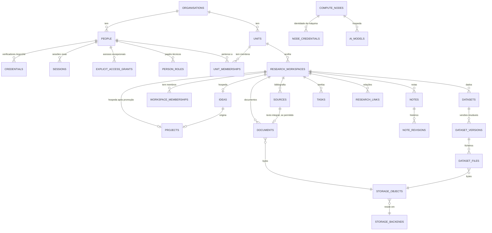

# Modelo de dados

PostgreSQL é a fonte canónica dos metadados institucionais. Os blobs vivem em
object storage; a base guarda metadata e referências.

## Princípio: a proveniência nasce com o sistema

Cada entidade institucional transporta quem a criou, quando, em que unidade e com
que classificação. Isto não é acrescentado depois: é o que permite ao sistema
responder, daqui a anos, "de onde veio este resultado?".

## Visão geral

## O Research Workspace é o contexto de autorização

Tudo o que uma ideia ou projecto acumula pertence ao mesmo workspace, e é dele
que deriva o contexto de autorização: unidade + workspace + classificação.

É isto que faz com que **uma decisão de membership governe todo o ambiente de
investigação**, em vez de o membro ter de ser autorizado artefacto a artefacto.

## Linhagem ideia → projecto

Na promoção, o **mesmo workspace** passa a hospedar o projecto. Tudo o que foi
reunido durante a exploração permanece ligado, e a linhagem fica registada dos
dois lados: `ideas.promoted_project_id` e `projects.origin_idea_id`.

Uma constraint garante a consistência: uma ideia `promoted` tem de nomear o seu
projecto, e só uma ideia `promoted` o pode fazer.

## Invariantes impostos pela base de dados

Não apenas pela aplicação — pela própria base:

| Invariante | Mecanismo |
|---|---|
| `audit_events` não aceita `UPDATE` nem `DELETE` | Trigger |
| Fechar uma ideia exige motivo | `CHECK` |
| `promoted` exige projecto, e só `promoted` o pode ter | `CHECK` |
| Texto integral exige base legal registada | `CHECK` |
| Tarefa fechada tem timestamp de fecho, e só ela | `CHECK` |
| Versão publicada tem timestamp de publicação | `CHECK` |
| Versão retirada tem motivo | `CHECK` |
| Um só backend de storage por omissão | Índice único parcial |
| Uma relação não aponta para si própria | `CHECK` |
| Classificação só assume valores conhecidos | `CHECK` em cada tabela |

## Preservação

- **Memberships são revogadas, nunca apagadas.** Que uma pessoa pertenceu a uma
  unidade é memória institucional.
- **Notas são versionadas.** Cada edição fotografa a revisão anterior.
- **Versões de dataset são imutáveis.** Publicar cria uma linha nova; a anterior
  continua legível e citável — um resultado que citou a versão 1 tem de continuar
  reproduzível depois de existir a versão 2.
- **Comentários são retirados, não apagados.** A conversa faz parte do registo.
- **Ideias abandonadas ficam, com o motivo.** Porque foi abandonada é memória
  institucional, não ruído.

## Grafo de conhecimento

`research_links` é a semente do futuro Ocinye Knowledge Graph: relações tipadas
como linhas de primeira classe, não colunas ad-hoc, para que o grafo possa ser
construído sem remodelar o domínio.

Relações permitidas: `cites`, `supports`, `refutes`, `derived_from`, `uses`,
`produces`, `relates_to`.

## Migrations

| # | O quê |
|---|---|
| 0001 | Organização, pessoas, papéis, convites, unidades, auditoria, outbox |
| 0002 | Research workspaces, ideias, projectos |
| 0003 | Storage, documentos, bibliografia, notas, relações |
| 0004 | Datasets, versões, ficheiros |
| 0005 | Tarefas, comentários, actividade |
| 0006 | Índice de pesquisa, pgvector |
| 0007 | Compute Registry, credenciais de nó, registo de modelos, jobs de IA |
| 0008 | Identidade: `username`, credenciais, sessões, tentativas, grants |
| 0009 | Agentes de IA |
| 0010 | Correio: caixas, pertenças, índice de mensagens, rascunhos, outbox, preferências |

Toda a alteração de schema é uma migration nova. Migrations aplicadas não se
editam.

## Identidade e credenciais

Introduzido pela migration `0008`, sob o
[ADR-0103](../adrs/0103-core-owned-authentication.md).

### `people.username`

Nome de início de sessão. Único por organização e **insensível a maiúsculas**,
por índice sobre `lower(username)`. Guardado tal como foi escrito, para que a
interface mostre a forma que a pessoa escolheu.

A forma é imposta por constraint: 3–64 caracteres, ASCII, começa por letra,
termina em letra ou dígito.

`people.oidc_subject` mantém-se, agora vestigial: existe para que federar um
fornecedor externo no futuro não exija migração.

### `credentials`

Só verificadores. **Nunca uma palavra-passe**, em nenhuma forma.

| Coluna | Nota |
|---|---|
| `verifier` | PHC Argon2id. Uma constraint recusa qualquer coisa que não comece por `$argon2id$`. |
| `kind` | `temporary` ou `permanent`. |
| `state` | `active` · `consumed` · `expired` · `revoked`. |
| `expires_at` | **Obrigatório** para temporária, **proibido** para permanente. |

Quatro invariantes vivem na base de dados, não na aplicação:

1. uma temporária sem expiração é recusada — seria uma permanente disfarçada;
2. uma permanente com expiração é recusada — reintroduziria rotação pela porta
   das traseiras;
3. um verificador que não seja Argon2id é recusado;
4. índice único parcial: **no máximo uma** credencial `active` de cada tipo por
   pessoa. É isto que torna «emitir um reset invalida o anterior» um facto e não
   uma convenção.

### `sessions`

Guarda o **digest SHA-256** do token, nunca o token. Uma fuga da base de dados
não entrega sessões vivas.

`state` distingue `password_change_required` de `active`: é a coluna que torna a
regra do primeiro acesso verificável do lado do servidor.

### `authentication_attempts`

Sinal de throttling e evidência operacional. Guarda nome de utilizador, prefixo
de rede e desfecho. **Nunca** a palavra-passe, o seu hash ou o seu comprimento.

`ip_prefix` é `/24` ou `/64`: suficiente para reconhecer uma origem estranha,
aquém de registar onde um investigador está fisicamente.

### `explicit_access_grants`

O único caminho para `RESTRICTED` sem membership
([ADR-0101](../adrs/0101-permissions-scopes-and-grants.md)).

Constraints que valem a pena ler:

- `ck_grants_scope_id_agrees` — um grant com âmbito **tem** de nomear o alvo; um
  institucional **não pode**;
- `ck_grants_reason_is_substantive` — a razão tem no mínimo 8 caracteres;
- índice único parcial sobre os grants vivos, para que o mesmo acesso não seja
  concedido duas vezes.

Revogação é `revoked_at`, nunca `DELETE`.

### O que mudou em `people.status`

`departed` foi substituído por `disabled`. O primeiro confundia «saiu da
instituição» com «não pode entrar»; o segundo diz apenas a segunda coisa, e a
saída fica registada onde pertence — no offboarding e na auditoria.

## Correio

Introduzido pela migration `0010`, sob
[ADR-0400](../adrs/0400-mail-as-institutional-surface.md) a
[ADR-0407](../adrs/0407-mail-index-not-archive.md).

Oito tabelas: `mail_provider_settings`, `mailboxes`,
`shared_mailbox_memberships`, `mail_messages`, `mail_drafts`,
`mail_draft_attachments`, `mail_outbox`, `mail_preferences`.

### `mail_provider_settings` — sem credenciais, por desenho

Anfitrião, porto e modo de segurança são configuração operacional e vivem aqui.
A password **não tem coluna**. Vive apenas em `OCINYE_MAIL_PASSWORD`, lida no
arranque ([ADR-0401](../adrs/0401-mail-provider-abstraction.md)).

Não é disciplina — é estrutura. Não existe onde a escrever.

### `mailboxes` — a constraint que segura a privacidade

`ck_mailboxes_ownership_agrees`: uma caixa `personal` **tem** `owner_id`, uma
caixa `shared` **não tem**.

Sem ela, uma caixa partilhada com dono seria alcançável pelos dois ramos da
verificação de acesso, e a fronteira de privacidade
([ADR-0404](../adrs/0404-mail-privacy-boundary.md)) deixaria de valer. Verificada
contra PostgreSQL real.

### `mail_messages` — um índice, não um arquivo

Guarda metadados suficientes para desenhar uma lista: remetente, assunto,
excerto, data, estado de leitura, presença de anexos, `thread_key`, e o
`provider_id` para ir buscar o resto.

**Não guarda** corpos nem anexos ([ADR-0407](../adrs/0407-mail-index-not-archive.md)).

`thread_key` deriva de `References`/`In-Reply-To`, **nunca do assunto**: agrupar
por assunto junta mensagens não relacionadas com o mesmo texto, e no correio
institucional isso significa mostrar a alguém uma conversa em que não participou.

### `mail_draft_attachments`

Duas constraints que valem a pena ler:

- `ck_mail_attachment_filename_is_safe` — nada que se pareça com caminho;
- `ck_mail_attachment_has_one_source` — ou é um ficheiro carregado, ou é um
  artefacto institucional, nunca ambos. É o que permite saber que classificação
  aplicar.

### `mail_preferences`

`remote_content_policy` tem `block` por omissão, e a constraint limita-a a três
valores. Do lado do código, `RemoteContentPolicy::parse` devolve `Block` para
qualquer valor irreconhecível: uma preferência corrompida não pode voltar a
ligar o rastreio.
