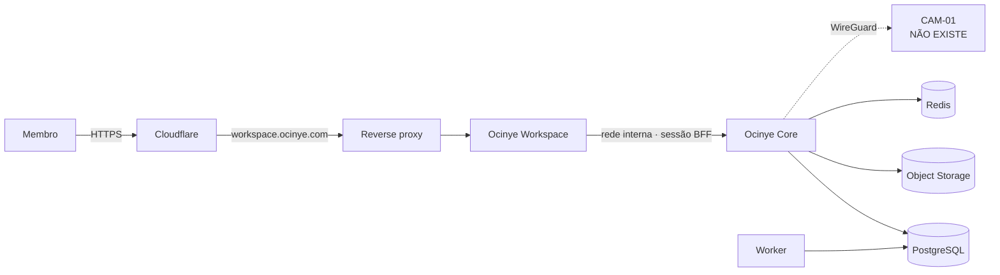

# Deployment

**Nenhum ambiente está deployado.** Este documento descreve o que está decidido e
o que falta.

## Arquitectura pretendida

- `workspace.ocinye.com` — a aplicação privada. **É a prioridade.**
- `ocinye.com` — reservado para o futuro website público. **Não construir agora.**
- **Sem API pública separada.** Reduz a superfície exposta; outros clientes usam
  a mesma API versionada atrás do mesmo gateway.
- **O nó nunca aceita tráfego público de aplicação.**

## Orquestração

Docker Compose. **Não usar Kubernetes** nesta fase sem necessidade concreta
documentada em ADR.

## O que produção exigirá

O código já recusa arrancar mal configurado em produção:

| Verificação | Componente |
|---|---|
| Issuer OIDC definido e HTTPS | Core |
| Sem origem CORS wildcard | Core |
| URL público HTTPS | Workspace |
| Cookies de sessão `Secure` | Workspace |
| Client secret OIDC presente | Workspace |

## O que falta

| Falta | Estado |
|---|---|
| Imagens de container dos serviços | **Não existem.** Não há Dockerfile de produção. |
| Terminação TLS e certificados | Não configurados. |
| Segundo factor de autenticação (MFA) | **Não existe.** O ADR-0103 adiou-o deliberadamente; ver `docs/security/`. |
| Backups | Não configurados. |
| Métricas e alertas | Não implementados. |
| Runbook de deploy e de rollback | Não escritos. |
| Configuração de WireGuard | Não existe — não há nó. |

**Nada disto deve ser lido como estando pronto.**
