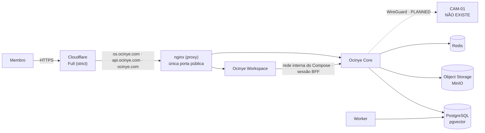

# Deployment

**Produção está a correr.** Core, Workspace e Worker servem a partir de um SHA
exacto de `origin/main`, atrás da Cloudflare. Não existe ambiente de staging nem
de desenvolvimento partilhado: entre a máquina de quem desenvolve e a produção
não há um ambiente intermédio.

## Arquitectura em produção



- `os.ocinye.com` — a aplicação privada (Workspace). **É a prioridade.**
- `api.ocinye.com` — a API do Core, atrás do mesmo proxy. Não é um segundo ponto
  de entrada com regras próprias: é a mesma política, o mesmo gateway.
- `ocinye.com` — reservado para o futuro website público. **Não construir agora.**
- **PostgreSQL, Redis e o object storage não são públicos.** Não declaram `ports:`;
  falam-se pela rede interna do Compose. A única porta para a Internet é o proxy.
- **O origin não aceita tráfego directo.** Responde só através da Cloudflare; um
  pedido ao IP do servidor não descobre que há ali um nginx.

## Orquestração

Docker Compose, governado por systemd (`infra/systemd/ocinye.service`), a partir de
`/srv/ocinye/current` com `infra/compose/docker-compose.production.yml`. O systemd
garante o arranque ordenado depois de um reboot; os contentores reiniciam-se
sozinhos por `restart: unless-stopped`. **Não usar Kubernetes** nesta fase sem
necessidade concreta documentada em ADR.

## Como um release chega a produção

`scripts/deploy-production.sh` leva um commit exacto da `main` canónica ao
servidor. O SHA do commit identifica o release: é o nome da pasta em
`/srv/ocinye/releases/<sha>`, a etiqueta das imagens, e o valor de
`OCINYE_RELEASE_SHA` em `/etc/ocinye/release.env`.

```text
árvore limpa + origin/main
  → git archive do SHA
  → sha256, confirmado do lado do servidor
  → extrair em /srv/ocinye/releases/<sha>
  → instalar as configs do nginx do release
  → docker compose build (imagens etiquetadas com o SHA, compiladas no host)
  → trocar o symlink /srv/ocinye/current
  → docker compose up -d
```

- **Sem registry.** Com um servidor, o que interessa é que produção corra um
  commit exacto, e isso consegue-se sem GHCR nem token de registry no VPS.
- **As migrações aplicam-se sozinhas no arranque do Core** (`db::migrate`). Um
  deploy que troque a imagem do Core aplica as migrações novas que ela traga.
- **A raiz de selagem** (`OCINYE_SEALING_KEY`) vive em `/etc/ocinye/*.env`, fora
  do Git. O Core recusa arrancar se `OCINYE_SEALING_KEY` e o nome legado
  `OCINYE_MAIL_KEY` estiverem ambas presentes com valores **diferentes**.

Os segredos vivem em `/etc/ocinye/*.env` (`comum.env`, `core.env`,
`workspace.env`, `postgres.env`, `object-store.env`), nunca no Git.

## O que produção exige

O código recusa arrancar mal configurado em produção:

| Verificação | Componente |
|---|---|
| Origem CORS sem wildcard | Core |
| Raiz de selagem coerente (não duas chaves em conflito) | Core |
| URL público HTTPS | Workspace |
| Cookies de sessão `Secure` | Workspace |
| Transporte Core declarado (`local-container` quando o Core é interno) | Workspace |

## Estado dos componentes de operação

| Componente | Estado |
|---|---|
| Imagens de container dos serviços | **Existem**, construídas no host a partir do release, etiquetadas pelo SHA. |
| Terminação TLS | **Cloudflare Full (strict)** com certificado Origin CA no servidor. |
| Segundo factor (MFA) | **Operacional** para identidades privilegiadas ([ADR-0107](../adrs/0107-mandatory-mfa-sessions-and-recovery.md)). |
| Procedimento de deploy | **Existe** — `scripts/deploy-production.sh`. |
| Backups periódicos off-host | **Por fazer.** O mecanismo de continuidade existe e está provado; falta destino externo e um agendador instalado ([backups](../backups/README.md)). |
| Métricas e alertas | **Não implementados.** Logs estruturados e limitados por rotação existem. |
| Runbook de rollback | **Por escrever.** O `current` anterior fica em `/srv/ocinye/releases/`, o que torna a reversão possível, mas o procedimento não está documentado. |
| Ambiente de staging | **Não existe.** |
| WireGuard / nó de computação | **Não existe** — não há nó. |
