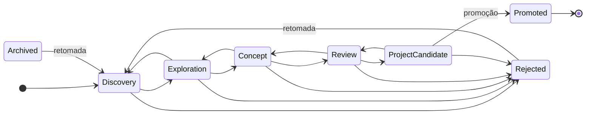

# Domínio institucional

O domínio determina a arquitectura, não o contrário. O Ocinye OS **não** é uma
colecção de CRUDs: "uma tabela → um CRUD → uma página" produziria um gestor de
ficheiros, não um sistema operacional institucional.

## Ideia não é projecto

A primeira fase científica da Ocinye começa pelas **primeiras ideias de projectos
de cada unidade**, não por projectos formais.

| | `Idea` | `Project` |
|---|---|---|
| Representa | Pergunta, problema, hipótese, oportunidade | Iniciativa formalmente assumida |
| Estados | `Discovery` → `Exploration` → `Concept` → `Review` → `ProjectCandidate` | `Draft` → `Active` → `OnHold` → `Completed` → `Archived` |
| Saídas honestas | `Rejected`, `Archived` — **com motivo obrigatório** | `Archived` |
| Exigências | Só título e unidade | Código, objectivos, responsável |

**Nem todas as ideias se tornam projectos, e isso é um desfecho legítimo.** Uma
ideia em `Discovery` pode ser fina; forçar uma especificação completa
transformaria investigação exploratória em papelada de projecto.

**Porque uma ideia fechada exige motivo:** porque foi abandonada é memória
institucional. Daqui a cinco anos, a pergunta "já tentámos isto?" só tem resposta
útil se a resposta anterior tiver ficado registada.

### Os ciclos de vida, tal como o código os define

As transições permitidas vivem em `crates/ocinye-domain/src/workflow/`. Nenhum
cliente as escolhe, e nenhum modelo as propõe: propor uma transição ilegal
produz uma recusa do domínio, não um estado novo.



`Archived` é alcançável a partir de qualquer estado activo, e omitido do
diagrama acima apenas para o manter legível. **`Promoted` é terminal**, e é o
único estado que uma transição ordinária não alcança.

O ciclo do Projecto é mais curto, porque um projecto formal tem menos estados
intermédios e mais compromisso em cada um:

| De | Para |
|---|---|
| `Draft` | `Active` · `Archived` |
| `Active` | `OnHold` · `Completed` · `Archived` |
| `OnHold` | `Active` · `Archived` |
| `Completed` | `Active` · `Archived` |
| `Archived` | — terminal |

Reabrir um projecto concluído é legítimo, e acontece. Arquivar não é: o registo
fica.

## Promoção preserva tudo

`promoted` não é alcançável como transição ordinária — só através da promoção.
Um cliente não pode afirmar que um projecto existe movendo um estado.

Na promoção, o **mesmo Research Workspace** passa a hospedar o projecto. Tudo o
que foi reunido durante a exploração — fontes, notas, documentos, datasets,
tarefas — permanece ligado. A linhagem fica registada dos dois lados e nunca é
reescrita.

## O Research Workspace é o contexto

Cada ideia ou projecto tem um ambiente contextual que reúne: visão geral, estado,
membros, unidade, classificação, bibliografia, fontes, notas, documentos,
datasets, tarefas, comentários, actividade, histórico.

Isto não é organização de interface: é o **contexto de autorização**. Uma decisão
de membership governa todo o ambiente, em vez de o membro ser autorizado
artefacto a artefacto.

### Quem pode o quê, e onde isso é decidido

Três dimensões independentes, e nunca colapsadas numa só (`CLAUDE.md` §34):

| Dimensão | Onde vive | O que governa |
|---|---|---|
| **Papel técnico** | `person_roles` | O que a pessoa é na instituição: `ResearchMember`, `UnitManager`, `PlatformAdmin`… |
| **Pertença a unidade** | `unit_memberships` | `Manager` ou `Member` de uma unidade científica |
| **Pertença a ambiente** | `workspace_memberships` | `Lead`, `Member` ou `Viewer` de um Research Workspace |

A consequência prática é frequentemente mal compreendida, por isso vale a pena
dizê-la em números:

- **`PUBLIC` e `INTERNAL` são legíveis por qualquer membro activo da
  organização.** A pertença não é o que os governa.
- **`CONFIDENTIAL` exige pertença** à unidade ou ao ambiente — ou ser
  administrador da organização.
- **`RESTRICTED` é mais estreito ainda**, e um artefacto classificado acima do
  seu ambiente leva a sua própria classificação, não a do ambiente.

E **escrever exige mais do que ler**: criar uma Nota ou uma relação exige
pertença ao ambiente, ou gestão da unidade. Pertencer à unidade permite ver;
não permite escrever em todos os ambientes dela.

### O estado pertence ao módulo que o detém

Uma Nota pertence a `knowledge`. Uma tarefa pertence a `collaboration`. Um
Projecto pertence a `research`. Nenhum módulo altera o estado de outro: pede-o
ao serviço que o detém, e esse serviço aplica o seu invariante.

O Research Workspace é a excepção aparente, e não é excepção nenhuma: os outros
módulos **lêem** o ambiente para obter o seu contexto de autorização, através de
`research::get_workspace`. Nunca o alteram.

## Research objects

Artefactos científicos são objectos relacionáveis, não registos isolados. As
relações vivem em `research_links`, como linhas tipadas de primeira classe, e uma
relação só existe se a tripla **tipo de origem + verbo + tipo de destino** for
permitida pela matriz de compatibilidade — que falha fechada.

```text
Hipótese   ←  testa           ←  Estudo
Estudo     →  segue           →  Versão de metodologia
Dataset·v  →  entra em        →  Execução
Resultado  →  produzido por   →  Execução
Resultado  →  sustenta/refuta →  Hipótese
Versão     →  substitui       →  Versão anterior
```

**A versão, e nunca o objecto mutável.** Um estudo segue uma `MethodologyVersion`
e nunca a `Methodology`; uma `DatasetVersion` entra numa execução e nunca o
`Dataset`. É o que torna a proveniência estável no tempo.

O vocabulário completo — dezassete entradas, contando os dois valores de origem —
vive em
[`crates/ocinye-contracts/src/provenance.rs`](../../crates/ocinye-contracts/src/provenance.rs).
O ciclo, a proveniência e a linhagem estão em
[docs/architecture/scientific-lifecycle.md](../architecture/scientific-lifecycle.md).

Isto é a base do futuro **Ocinye Knowledge Graph**, e continua sem precisar de
uma base de dados de grafos.

## System of record

O Core deve poder responder: quem criou isto, quando, porquê, em que unidade,
ligado a que ideia, a que projecto, com que dataset, que versão, que código, que
estudo, que execução, quem aprovou, com que classificação, onde residiam os
dados, quem teve acesso.

**A rastreabilidade nasce com o sistema.** Cada entidade transporta autoria,
momento, unidade e classificação desde a primeira migration.

## Endereçável por agentes

Os artefactos deste domínio endereçáveis pelo Agentic Control Plane incluem
`Idea`, `Project`, `Workspace`, `Note`, `Source`, `Document` e `Task`, e — desde o
ciclo científico — `Hypothesis`, `Methodology`, `MethodologyVersion`, `Study`,
`StudyExecution`, `Result` e `DatasetVersion`. A lista completa é o
`ResourceKind` de
[`crates/ocinye-contracts/src/agentic.rs`](../../crates/ocinye-contracts/src/agentic.rs),
que é a fonte.

Endereçável **não** significa acessível. Um `ResourceRef` identifica; resolvê-lo
continua sujeito ao actor, ao âmbito do agente, à pertença, à política do
recurso e à classificação — e uma referência que não resolve devolve a mesma
resposta que um identificador inventado
([ADR-0306](../adrs/0306-resource-resolution-as-authorization-boundary.md)).

As operações publicadas estão em
[`docs/agentic/`](../agentic/README.md). São deliberadamente poucas: o Core
expõe muito mais pela sua API HTTP, e transformar cada endpoint numa ferramenta
produziria cem portas por testar.

## Ainda não modelado

`Model`, `Publication`, `IntellectualProperty`, `Funding` e `CodeRepository` estão
na visão arquitectural e **não** têm tabelas. São a próxima camada do domínio, e a
proveniência foi desenhada para os suportar quando existirem.

`Result` deixou de estar nesta lista: existe, com tabela própria, desde a
[migration 0019](../../migrations/0019_scientific_lifecycle.sql).

**`Experiment` não vai existir como entidade.** O domínio adoptou `Study` com um
género fechado — experiência física, simulação ou análise — porque os três
partilham tudo o que importa a esta camada, e três tabelas obrigariam a triplicar
cada consulta de linhagem
([ADR-0412](../adrs/0412-scientific-lifecycle-and-provenance.md)).
