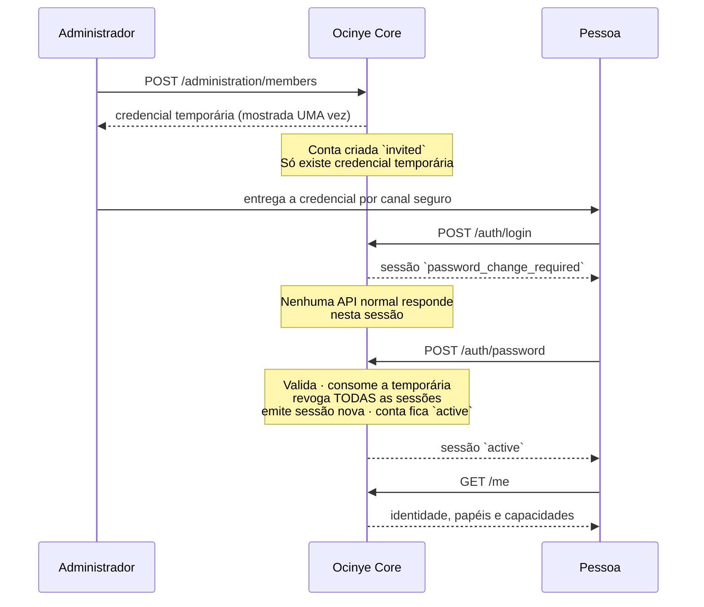

# Identidade

Decisão: [ADR-0103](../adrs/0103-core-owned-authentication.md), que substitui o
[ADR-0102](../adrs/0102-identity-provider.md).
Palavras-passe: [ADR-0104](../adrs/0104-password-policy-and-hashing.md) e
[docs/password-policy/](../password-policy/README.md).
Autorização (distinta de identidade): [docs/authorization/](../authorization/README.md).

## Estado

| | |
|---|---|
| Autenticação | **`CURRENT`** — nome de utilizador e palavra-passe, no Ocinye Core |
| MFA | **`NOT IMPLEMENTED`**, e **não exigido** nesta fase |
| Passkeys / WebAuthn | `PLANNED` |
| Recuperação por link seguro | `PLANNED` — hoje a recuperação é administrativa |
| SSO / IdP federado | `PLANNED` — o esquema já o comporta |

Não há factor além da palavra-passe. É por isso que o mínimo são 15 caracteres.

## O Core é a autoridade de autenticação

O Ocinye Core decide quem entra. Nunca armazena uma palavra-passe: guarda um
**verificador Argon2id** em formato PHC, e a única vez que existe texto em claro
é durante o pedido em que é verificado.

O Ocinye Workspace recolhe as credenciais e encaminha-as. Não valida, não compara
e não decide.

## Como uma pessoa passa a ter acesso



**A credencial que o administrador cria nunca entra no Workspace.** Serve
exclusivamente para o seu titular definir a sua própria palavra-passe.

## O primeiro administrador

```bash
ocinye-core-server bootstrap-admin \
  --name "Nome Completo" \
  --username nome.utilizador \
  --email pessoa@ocinye.com
```

Corre **uma única vez**: recusa se já existir um `platform_admin` utilizável na
organização, verificado antes e dentro da transacção. Não há flag de override.

O primeiro administrador começa, como toda a gente, com credencial temporária.
**Não existe palavra-passe de bootstrap permanente.**

Runbook: [Bootstrap do primeiro administrador](../runbooks/bootstrap-first-administrator.md).
Perda de acesso administrativo: [Recuperar acesso administrativo](../runbooks/recover-administrative-access.md).

## Nome de utilizador

| Regra | Valor |
|---|---|
| Comprimento | 3 a 64 caracteres |
| Caracteres | letras ASCII, dígitos, `.`, `-`, `_` |
| Primeiro carácter | letra |
| Último carácter | letra ou dígito |
| Unicidade | por organização, **insensível a maiúsculas** |
| Alteração | só por fluxo administrativo; nunca pelo titular |

Guardado tal como foi escrito, comparado em minúsculas. `FMonteiro` e
`fmonteiro` são a mesma conta e não podem coexistir.

Não são aceites caracteres não-ASCII: um nome que se escreve de duas maneiras é
um nome que alguém não vai conseguir usar ao telefone.

## Estados de conta

| Estado | Autentica | Notas |
|---|---|---|
| `invited` | Sim, para uma **sessão restrita** | Criado por um administrador; nunca definiu palavra-passe |
| `active` | Sim | Normal |
| `suspended` | Não | Sessões revogadas. Autoria e histórico preservados |
| `disabled` | Não | Identidade histórica permanente. **Nunca apagada** |

Um administrador não pode suspender nem desactivar a própria conta: é assim que
uma instituição fica sem administrador e sem caminho de volta.

`suspended` e `disabled` revogam **imediatamente** todas as sessões. Uma decisão
de acesso que só produz efeito no próximo início de sessão não é uma revogação.

## Estados de credencial

| Estado | Significado |
|---|---|
| `active` | Utilizável |
| `consumed` | Já serviu para definir uma palavra-passe. Nunca mais é aceite |
| `expired` | Passou a validade |
| `revoked` | Substituída ou revogada por um administrador |

Uma constraint garante que **no máximo uma** credencial de cada tipo está
`active` por pessoa. É o que torna «emitir um reset invalida o anterior» um facto
da base de dados e não uma convenção da aplicação.

A expiração é avaliada **na verificação**, nunca confiada a uma varredura: uma
linha pode estar `active` para lá da validade e tem de ser recusada na mesma.

## Sessões

| | |
|---|---|
| Formato | Identificador opaco, 256 bits do CSPRNG do sistema |
| Armazenamento | Apenas o digest SHA-256, em `sessions` |
| Cookie | `HttpOnly` · `SameSite=Strict` · `Secure` fora de desenvolvimento |
| Duração normal | 12 horas |
| Duração restrita | 30 minutos |

**Não há promoção de sessão.** Uma sessão emitida para mudança de palavra-passe é
revogada e substituída, nunca elevada no lugar: o identificador que o browser
deteve durante o arranque não volta a ser aceite.

Rotação obrigatória depois de: início de sessão, mudança de palavra-passe e
reset administrativo.

### Efeito de alterações críticas

| Evento | Sessões existentes |
|---|---|
| Suspensão | Revogadas imediatamente |
| Desactivação | Revogadas imediatamente |
| Reset de palavra-passe | Revogadas imediatamente |
| Mudança de palavra-passe pelo titular | Revogadas, e emitida uma nova |
| Alteração de papel | **Mantidas**, mas sem efeito acumulado: papéis, memberships e grants são lidos da base de dados **a cada pedido**. Não existe autorização em cache na sessão |

Essa última linha é a razão pela qual uma alteração de papel não precisa de
revogar sessões: não há nada de stale para invalidar.

## O que o Core nunca faz

- Armazenar uma palavra-passe, em qualquer forma reversível.
- Devolver uma palavra-passe a alguém, incluindo ao administrador principal.
- Distinguir, na resposta, entre «utilizador não existe», «palavra-passe
  errada», «credencial expirada» e «conta suspensa».
- Registar uma palavra-passe, o seu hash ou o seu comprimento em log, auditoria
  ou métrica.

Um administrador pode **repor** o acesso, emitindo nova credencial temporária.
Nunca pode **consultar** o existente.

## Verificação

```bash
OCINYE_TEST_DATABASE_URL="postgres://…/ocinye_test" \
  cargo test -p ocinye-core --test identity
```

Corre contra PostgreSQL real. Prova, entre outros invariantes, que uma credencial
temporária nunca abre sessão normal, que expira, que é consumida ao ser usada, e
que nenhuma palavra-passe aparece em `credentials`, `audit_events` ou
`authentication_attempts`.
