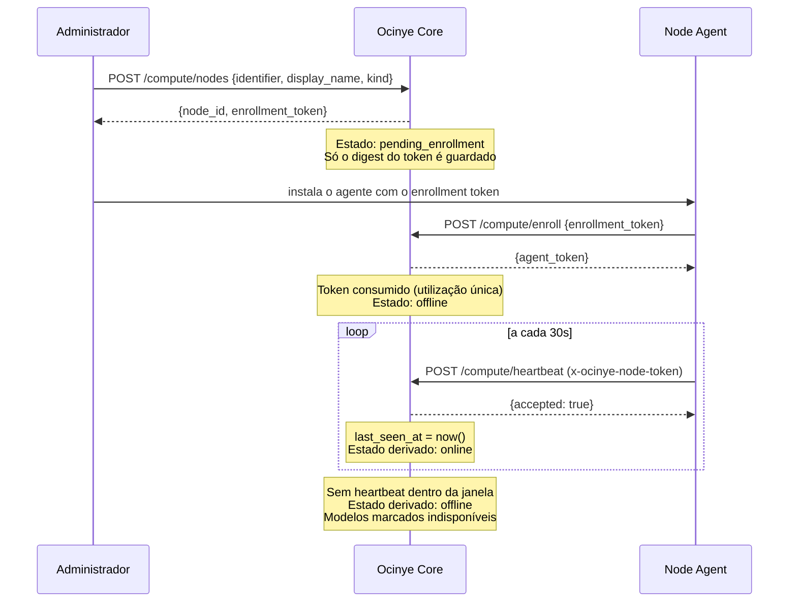

# Protocolo do Node Ocinye — v1

Contrato entre o [Node Agent](../../services/node-agent/README.md) e o
[Ocinye Core](../../crates/ocinye-core/README.md).

**Estado:** `CURRENT` para enrolamento e heartbeat. Despacho de jobs: `PLANNED`.
Nenhum nó computacional da Ocinye existe.

## Princípios

1. **Um nó não é um utilizador.** Tem identidade própria e nunca reutiliza
   credenciais humanas.
2. **A ligação é só para fora.** O Core nunca abre ligação para o nó. O nó não
   aceita tráfego de aplicação. A topologia futura é `VPS → WireGuard → nó`.
3. **O que um nó diz sobre si é entrada não confiável.** Um nó comprometido pode
   mentir; nada do que reporta influencia uma decisão de autorização.
4. **A liveness é derivada, nunca declarada.** Não existe flag que alguém possa
   pôr a `true`.

## Ciclo de vida



## Endpoints

### `POST /api/v1/compute/nodes` — registar

Autenticação: membro com `platform_admin`.

```json
{ "identifier": "CAM-01", "display_name": "Camama GPU 01",
  "kind": "gpu", "location_label": "Camama, Angola" }
```

Resposta: `{ "node_id": "…", "identifier": "CAM-01", "enrollment_token": "…" }`

O token é devolvido **uma só vez**. Só o seu digest SHA-256 é persistido.

> `CAM-01` aqui é um exemplo de valor, não uma constante. Nenhum identificador de
> nó aparece no código.

### `POST /api/v1/compute/enroll` — enrolar

Autenticação: o próprio token de enrolamento.

Troca um token de utilização única por uma credencial de agente. A troca é
atómica: o `UPDATE … WHERE consumed_at IS NULL` é ele próprio a verificação, pelo
que um segundo uso concorrente falha em vez de correr.

Tokens desconhecidos, expirados e já consumidos são indistinguíveis na resposta.

### `POST /api/v1/compute/heartbeat` — reportar

Autenticação: `x-ocinye-node-token`. **Não** `Authorization`: uma credencial de
máquina é outra coisa, e confundi-las convida à reutilização.

```json
{
  "agent_version": "0.1.0",
  "resources": { "cpu_cores": 64, "memory_bytes": 274877906944,
                 "storage_bytes": 0, "gpus": [] },
  "capabilities": [],
  "models": [],
  "health": { "uptime_seconds": 1234,
              "gpu_discovery": "not_implemented",
              "model_discovery": "not_implemented" }
}
```

Os números são **limitados ao domínio da coluna** antes de serem escritos: um
agente hostil não pode provocar overflow.

Os modelos reportados substituem os anteriores do nó. Quando um nó deixa de
reportar, o Worker marca os seus modelos como indisponíveis — sem isso, um nó que
morresse deixaria os seus modelos anunciados como disponíveis.

## Estados de um nó

| Estado | Significado |
|---|---|
| `pending_enrollment` | Registado, token emitido, nunca visto. |
| `online` | Heartbeat dentro da janela de liveness. |
| `offline` | Enrolado, sem heartbeat recente. |
| `draining` | A terminar trabalho, sem aceitar novo. |
| `retired` | Retirado. |

`online` e `offline` são **derivados** de `last_seen_at`. Os restantes são
administrativos e não são sobrepostos pela liveness.

## Versionamento

Este é o protocolo v1. Uma mudança incompatível é uma versão nova, com ADR e
entrada no CHANGELOG — como qualquer contrato.

## Não implementado

- Despacho e execução de jobs.
- Rotação de credencial de agente.
- Autenticação mútua TLS.
- Descoberta de GPU e de modelos no agente.
