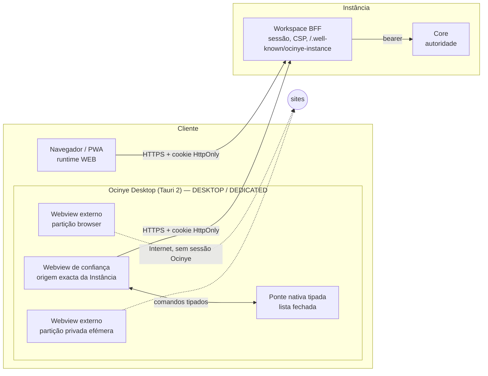

# Runtimes — arquitectura-alvo

> Decidida nas ADRs [0018](../adrs/0018-universal-web-access-and-runtime-classes.md),
> [0611](../adrs/0611-runtime-capability-boundary.md),
> [0612](../adrs/0612-browser-manager.md) a [0617](../adrs/0617-pwa-and-service-worker-policy.md)
> e [0702](../adrs/0702-desktop-shell-technology.md) a
> [0705](../adrs/0705-dedicated-runtime.md). Tudo o que está aqui é `PLANNED`
> até a fase que o implementa o provar.

## A frase

> **A instalação acrescenta ao Ocinye. Nunca é precisa para chegar ao Ocinye.**
> **A casca hospeda; o Core governa.**

## Visão

## Camadas

| Camada | Um código para os três runtimes | Muda por runtime |
|---|---|---|
| Core | autorização, dados, auditoria | nada |
| Workspace (SSR + `app.js`) | rotas, ecrãs, i18n, apps, Desktop, Nye, Terminal, Ficheiros | nada — lê `ocinyeRuntime` |
| `static/runtime.js` | a declaração de capacidades (ADR-0611) | a única origem da detecção |
| Browser Manager (cliente) | API única de navegação externa (ADR-0612) | `iframe` + recurso honesto na Web; webviews na casca |
| Casca | — | Tauri 2: janelas, webviews, ponte, protocolo, actualizador |

## Fluxos

**Ligar a uma Instância (Desktop).** Endereço `https` → TLS → `GET
/.well-known/ocinye-instance` no host escrito → confiar (impressão digital) →
webview de confiança carrega a origem → login da Instância (D3) → contexto →
Desktop.

**Abrir um site.** UI/ocsh/Nye → `ocinye-browser` → Browser Manager → (Web)
`iframe` com *sandbox*, ou recurso honesto → (Desktop) `browser.*` na ponte →
webview externo na partição.

**Guardar transferência no Ocinye Files.** Webview externo → casca (stream para
temporário 0600) → sessão de carregamento por partes da BFF → Core (quota, RBAC,
tipo) → Garage.

**`ocinye://`.** Parser único (`ocinye-contracts`) → rota HTTPS equivalente →
router do Workspace. Sem casca, a rota HTTPS.

## Fases

| Fase | Entrega | Portão |
|---|---|---|
| R0 | discovery + ADRs | este documento |
| R1 | `ocinye_contracts::runtime` + `static/runtime.js` + guarda anti-detecção espalhada — **feito** | unitários + guarda por reversão + viagem de browser |
| R2 | PWA (manifesto, sem service worker), `X-Ocinye-Build`, faixa «nova versão», Definições › Runtime, viagem constitucional Web — **feito** | E2E |
| R3 | casca: arranque, ligação, confiança, login, webview de confiança; prova de partições por plataforma | E2E por plataforma |
| R4 | ponte tipada; navegação fora da origem interceptada | negativos |
| R5 | Browser Manager + webview externo isolado | E2E isolamento |
| R6 | abas, navegação, histórico local, privado | E2E privado |
| R7 | transferências para Ficheiros e computador | E2E grande/cancelar/nomes hostis |
| R8 | `ocinye://` + rotas HTTPS | parser *fuzz* + E2E |
| R9 | Nye + ocsh `browser` | E2E injecção |
| R10 | notificações nativas, diálogos, protocolo registado | E2E por plataforma |
| R11 | Dedicated (distribuição suportada, sem root) | máquina real |
| R12 | visual D15 | auditorias de integração do Design |
| R13 | certificação | declarações separadas |
